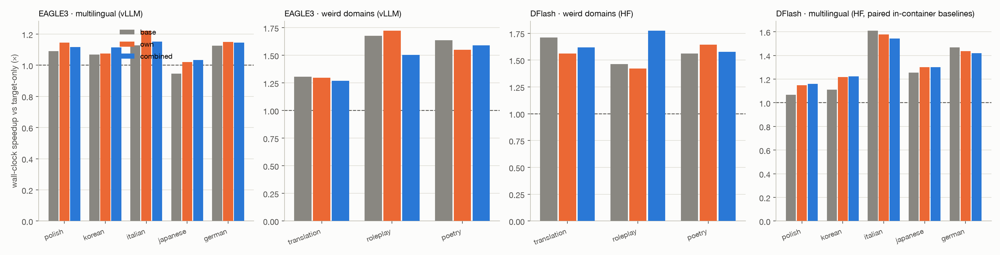
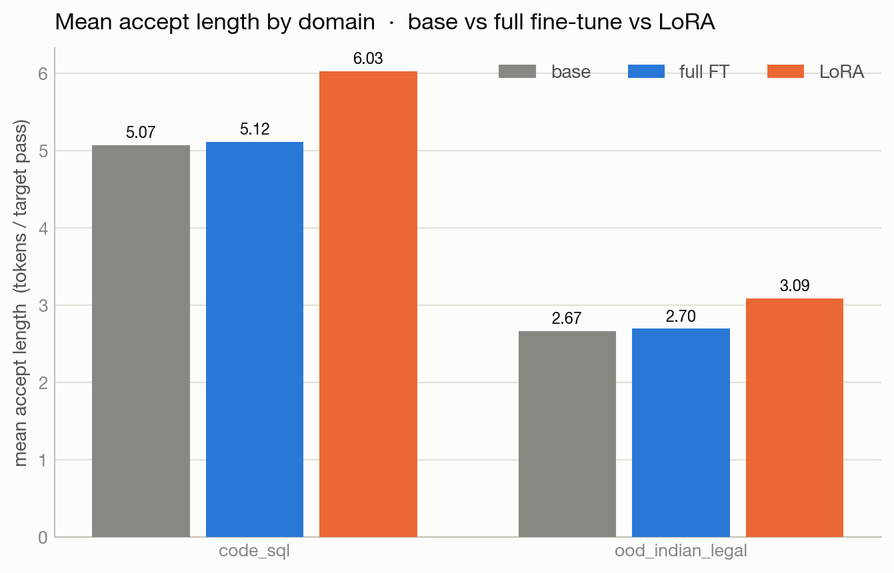

# Specialization Is All Speculation Needs

**TLDR:** Speculative decoding gets weakest in the long tail. For DFlash on
`Qwen/Qwen3-8B`, per-language rank-16 LoRAs improved the weakest WildChat
language lanes: Polish, Hungarian, Korean, Dutch, Romanian, and Turkish gained
**+1.06pp to +1.97pp** acceptance in the clean 1,000-train-prompt subset. A
direct control on four weak languages says this is not just "train more
parameters": own-language LoRAs averaged **+1.37pp** acceptance over base, while
full fine-tunes averaged **+0.10pp**. The big surprise is that routing is not the
whole production story. A 26-way language router reached **84.7%** validation /
**81.6%** test accuracy, and routed own-language LoRAs beat the combined LoRA on
mean acceptance by only **+0.11pp**. In the clean H200 serving benchmark, merged
combined improved DFlash from **1.418x** to **1.501x** over target-only, almost
tied N merged specialists at **1.508x**, while unmerged hot-swapping fell to
**1.170x** despite matching the specialist acceptance.

## Background

Speculative decoding is an inference technique where a smaller draft model
proposes several tokens and a larger target model verifies them all at once.
When the draft tokens match what the target model would have generated, the
system commits multiple tokens per target forward pass.

The important detail is that the drafter is not trying to be correct in an
external sense. It is trying to copy the verifier.

If the target would say:

> the sky is green

then the drafter should say:

> the sky is green

not:

> the sky is blue

Even if blue is more factually plausible, speculative decoding only cares about
matching the target. At temperature 0, all of these experiments are lossless:
the adapter changes speed, not the final target output.


Our hypothesis was capacity-shaped. A public drafter is a small approximation of
a larger verifier, and that approximation has to allocate capacity across the
verifier's behavior. Common regions get modeled well. Long-tail regions get
modeled poorly. If that is true, specializing the drafter should help most where
the base drafter is weakest.


The second hypothesis was about interference. If domains overlap in a confusing
way, one combined adapter may become muddy and lose to specialists. If domains
are cleanly separable, one combined adapter may get most of the specialist gain.

## Languages As Domains

We started with languages because DFlash was weakest when the target was
speaking outside the common English / code-heavy path.

**Benchmark source:** `new/exp1-language/results/summary.json`, the WildChat-4.8M
language run. We split first-turn prompts by the dataset's language column. For
the main story, we use the clean subset of 26 languages with 1,000 train prompts
each, then evaluate base `z-lab/Qwen3-8B-DFlash-b16` against target
`Qwen/Qwen3-8B` on held-out prompts. The full 40-language atlas is kept as a
diagnostic in the appendix.


DFlash did not degrade smoothly across languages. The weakest lanes were several
times worse than the easiest ones:

| language | base DFlash acceptance |
|---|---:|
| Polish | 3.57% |
| Hungarian | 3.92% |
| Korean | 4.19% |
| Dutch | 4.55% |
| Romanian | 4.60% |
| Turkish | 4.89% |
| English | 12.90% |
| Latin | 11.85% |

This is the motivation for specialization: the drafter has obvious missing
coverage in the language tail. EAGLE3 and the broader DFlash/EAGLE base atlas
are useful context, but they are appendix material; the main experiment here is
DFlash language specialization on WildChat.

## Training Language-Specific LoRAs

For the main language run, we used WildChat-4.8M. We split first-turn prompts by
the dataset's language column, used 1,000 train / 100 val / 100 test prompts per
language for the clean subset, and generated target answers greedily with
`Qwen/Qwen3-8B`. The drafter was trained on target behavior, not human reference
answers.

This section is only about the language-specific LoRAs:

1. Fetch WildChat prompts by language.
2. Generate target answers.
3. Capture target hidden states for DFlash training.
4. Train one rank-16 LoRA per language.
5. Benchmark base versus the matching language LoRA on held-out prompts.

The result matched the first hypothesis:

> The weaker the base speculator was on a language, the more specialization
> helped.

Some representative weak-language lanes:

| language | base | own-language LoRA | gain | relative gain |
|---|---:|---:|---:|---:|
| Polish | 3.57% | 4.65% | +1.08pp | +30.3% |
| Hungarian | 3.92% | 5.78% | +1.86pp | +47.4% |
| Korean | 4.19% | 5.25% | +1.06pp | +25.3% |
| Dutch | 4.55% | 6.03% | +1.48pp | +32.5% |
| Romanian | 4.60% | 5.81% | +1.22pp | +26.6% |
| Turkish | 4.89% | 6.86% | +1.97pp | +40.3% |

This is the core specialization result: the bad language lanes move the most.


## LoRA Versus Full Fine-Tuning

One concern is that LoRA is not the important part. Maybe full fine-tuning the
drafter would work just as well or better.

We had LoRA-vs-full-FT evidence on non-language domains, but that does not
belong in the main language story. So we ran the direct language comparison on
the weak 1,000-train-prompt lanes where the claim matters most:

- Polish
- Hungarian
- Korean
- Dutch

The experiment trains all DFlash parameters on the same frozen target-hidden
language shards used by the LoRAs, then benchmarks on held-out WildChat prompts.
The combined LoRA is intentionally excluded from this comparison; combined
belongs in the routing section below.

| variant | what |
|---|---|
| `base` | public DFlash drafter |
| `own` | existing per-language rank-16 LoRA |
| `full` | full DFlash fine-tune on that language |

The result was not subtle. The LoRA moved the drafter; the full fine-tune mostly
stayed glued to base.


| language | base | own LoRA | own gain | full FT | full gain |
|---|---:|---:|---:|---:|---:|
| Polish | 3.57% | 4.65% | +1.08pp (+30.3%) | 3.65% | +0.08pp (+2.2%) |
| Hungarian | 3.92% | 5.78% | +1.86pp (+47.4%) | 4.03% | +0.11pp (+2.8%) |
| Korean | 4.19% | 5.25% | +1.06pp (+25.3%) | 4.29% | +0.10pp (+2.4%) |
| Dutch | 4.55% | 6.03% | +1.48pp (+32.5%) | 4.68% | +0.13pp (+2.9%) |

Across these four languages, own-language LoRA averaged **+1.37pp** acceptance
over base. Full fine-tuning averaged **+0.10pp**. This does not prove full
fine-tuning can never work; it says that, at the data scale where the LoRAs are
already useful, moving the whole DFlash drafter is the wrong lever.

## Routing And The Combined LoRA

After training language-specific LoRAs, the natural production idea was: build a
router, pick the right language adapter, and serve specialists.

For the clean `min_train=1000` subset, we trained the router on the same
target-hidden features DFlash consumes: mean-pooled `Qwen/Qwen3-8B` hidden
states, one MLP classifier, 26 languages, 1,000 train prompts and 100 validation
/ 100 test prompts per language. That gave **84.7%** validation accuracy and
**81.6%** test accuracy.

The strong cases were genuinely strong: Turkish and Japanese were **98%** test
accurate; Arabic, Persian, Korean, and Hungarian were **96%**. But the result was
not the earlier "languages route perfectly" story. Esperanto was **27%**,
Indonesian and Tagalog were **57%**, Yoruba and Latin were **58%**, English was
**59%**, and Malay was **61%**.

English being low is the giveaway that this is not pure language ID. The English
row had **59%** recall and **69.4%** precision; true-English prompts most often
leaked into Latin (**11/100**), Tagalog (**8/100**), Yoruba (**5/100**), Spanish
and Persian (**3/100** each). Looking at the prompts, many "English" examples are
really code, Excel, Bible commentary, mixed Cyrillic/code, or generic instruction
following. The Latin bucket is also noisy and contains many English prompts. So
the routing claim is softer and more useful: many language lanes are separable,
but WildChat language labels still contain related-language ambiguity,
mixed-language prompts, task/domain effects, and detector noise.


The earlier five-language router with an `other` bucket did get 100% validation
and test accuracy, but that was a smoke test on cleaner lanes. As a harder
diagnostic, the full 40-way classifier over every WildChat language lane got
**74.0%** validation accuracy and **68.8%** test accuracy. The 26-way router above
is the one we should cite in the main story because it matches the clean
`min_train=1000` language subset used in the LoRA and serving comparisons.

So the right comparison for routing is:

- route to the matching language-specific LoRA;
- use one combined multilingual LoRA trained across languages;
- compare both against base.

That result changed the story. We expected the routed specialists to dominate.
On the clean 26-language subset, the routed specialists did win on mean
acceptance, but only slightly:

- own specialists: +0.77pp mean acceptance versus base;
- combined adapter: +0.66pp mean acceptance versus base;
- head-to-head: own specialists led by only +0.11pp on average, and the combined
  adapter still won 6/26 languages.

The clean 26-language view makes this easier to see: the base drafter is the
gray reference, the matching language LoRA is blue, and the combined
multilingual LoRA is green.


The same clean 26-language comparison in analytic speedup units shows the
product-shaped version of the acceptance result. This uses the fitted drafter
overhead from the wall-clock calibration, so it is still a model, not the H200
serving measurement below.


Some weak-language examples:

| language | base | routed own LoRA | combined LoRA |
|---|---:|---:|---:|
| Polish | 3.57% | 4.65% | 4.41% |
| Hungarian | 3.92% | 5.78% | 5.16% |
| Korean | 4.19% | 5.25% | 4.95% |
| Dutch | 4.55% | 6.03% | 5.60% |
| Romanian | 4.60% | 5.81% | 5.51% |
| Turkish | 4.89% | 6.86% | 6.16% |


This makes the language result cleaner than the original framing:

> For language specialization, the main win is not routing among many adapters.
> The main win is adding target-distilled language coverage to the drafter.

The router is still useful for tenant isolation, open-set fallback, or future
acceptance-aware routing. But for language specialization, the combined adapter
is the simpler production artifact, and the merged serving benchmark supports
that path.

## Serving Cost

Acceptance is the science result. Wall-clock speedup is the product result.

There are two speedup numbers in this project, and the blog should label them
separately:

| speedup type | what it means | status |
|---|---|---|
| theoretical / analytic | predicted from mean accepted length, using a fitted drafter overhead | already measured and useful |
| actual / wall-clock | measured tok/s versus target-only in the same serving setup | merged combined, N merged specialists, and unmerged hot-swap measured on the clean 26-language serving set |

The analytic model is:

```text
speedup ~= mean_accept_length / (1 + drafter_overhead)
```

For DFlash in the paired HF multilingual benchmark, the fitted overhead was
`c = 0.445` target-forward units. That model predicted measured speedups very
well in the 5-language benchmark: median error **0.3%**, max error **4.9%**.

The old actual 5-language H200 benchmark showed that LoRA speedup gains were
concentrated in the weak lanes:

| language | target-only | base DFlash | routed own LoRA | combined LoRA |
|---|---:|---:|---:|---:|
| Polish | 1.00x | 1.07x | 1.15x | 1.16x |
| Korean | 1.00x | 1.11x | 1.22x | 1.22x |
| Italian | 1.00x | 1.61x | 1.58x | 1.54x |
| Japanese | 1.00x | 1.26x | 1.30x | 1.30x |
| German | 1.00x | 1.47x | 1.44x | 1.42x |



This is useful, but it is not the serving-cost result we should cite. For the
serving-cost section, we use the clean `min_train=1000` subset: 26 languages,
25 held-out prompts per language, 624 language switches, H200, greedy decode.
This avoids mixing serving speed with the low-data/noisy language-label issues
from the full 40-language diagnostic.

| mode | meaning |
|---|---|
| `base` | DFlash, no LoRA |
| `merged_combined` | one combined language LoRA folded into DFlash weights |
| `merged_own` | routed traffic to N already-merged language specialists |
| `hotswap_own` | one drafter with unmerged per-language LoRA hot swapping |

The merged combined LoRA is the production path we care about: it is folded into
the DFlash weights before decoding, so its serving path is the same as the base
drafter.


| mode | tok/s | actual speedup vs target-only | relative vs base DFlash | accept | mean accept length |
|---|---:|---:|---:|---:|---:|
| target-only | 46.78 | 1.000x | - | - | - |
| base DFlash | 66.33 | 1.418x | 1.000x | 6.46% | 1.969 |
| merged combined LoRA | 70.23 | 1.501x | 1.059x | 7.17% | 2.076 |
| N merged own LoRAs | 70.55 | 1.508x | 1.064x | 7.33% | 2.099 |
| hot-swapped own LoRAs | 54.73 | 1.170x | 0.825x | 7.32% | 2.098 |

So the combined LoRA gives a **+5.9% wall-clock gain over base DFlash** on this
mixed-language serving stream, and the one-time merge setup was only **0.073s**.
The N-merged-specialist path gives **+6.4% over base DFlash**, only about
**+0.5% relative to the merged combined LoRA**. In other words, for the clean
language subset, the combined merged adapter gets almost all of the wall-clock
benefit without serving N separate specialist drafters.

The hot-swap result is the cautionary row. It gets essentially the same
acceptance as the merged specialists, but drops to **54.73 tok/s**, or **0.825x**
relative to base DFlash. The measured adapter-copy time was tiny, only **0.237s**
across **625** language switches; the slowdown comes from keeping the LoRA path
unmerged inside the drafter forwards. For this workload, specialization only
turns into serving speed when the adapter is merged into the drafter weights.

## Conclusion

For languages, specialization is almost all speculation needs.

The public drafter is weakest on the long language tail. Target-distilled
language LoRAs patch that weakness. But the cleanest production result may be
even simpler than routing: one combined multilingual adapter gets most of the
specialist gain, as long as it is merged into the drafter weights before serving.

The story is:

1. Find where the drafter fails.
2. Distill target behavior in that region.
3. Add a small adapter.
4. If the specialization axis is low-interference, merge one combined adapter.
5. Only route specialists when combined adapters actually lose.
6. Do not assume higher acceptance means higher throughput if the serving path
   keeps adapters unmerged.

## Appendix And Future Ideas

This blog should keep the main claim language-specific. The following results
are useful, but they are appendix material, sanity checks, or seeds for a second
post about interference in more realistic production workloads.

### Result Archive

I swept the repo for reports, summaries, and comparison CSVs. These are the
completed result pockets that are not part of the main language story:

| result | key takeaway | path |
|---|---|---|
| base DFlash/EAGLE atlas | both speculators are weakest on languages; EAGLE has higher acceptance but smaller proposal depth | `experiments/00-base-benchmarks/results/` |
| SQL/legal LoRA vs full FT | LoRA moved DFlash; full fine-tune was near base at this data scale | `experiments/01-single-domain-dflash/results/` |
| five-language DFlash | early base/own/combined language run; useful for smoke and wall-clock | `experiments/02-multilingual-dflash/results/` |
| weird-domain DFlash | translation/roleplay/poetry LoRAs beat base on 3/3 | `experiments/03-weird-domains/results/dflash_report.md` |
| weird-domain EAGLE | EAGLE LoRAs did not improve those weird domains | `experiments/03-weird-domains/results/eagle_report.md` |
| multilingual EAGLE | EAGLE language LoRA run, corrected output | `experiments/04-multilingual-eagle/results/` |
| interference ladder | combined adapters over 10/20/40 domains show small own-vs-combined gaps | `experiments/05-interference-ladder/results/` |
| independent drafter | Qwen3-0.6B vanilla drafter improves acceptance with LoRA, but wall-clock remains below target-only | `experiments/06-independent-drafter/results/` |
| rank ladder | weak languages keep benefiting from higher LoRA rank more than moderate domains | `experiments/07-rank-ladder/results/` |
| wall-clock model | analytic speedup model matches measured DFlash multilingual speedup well | `experiments/08-wallclock/results/` |
| batched adapter serving | merged LoRA is basically free; naive unmerged wrappers and many Punica adapters can be costly | `experiments/09-batched-lora-serving/results/` |
| MoLE WildChat | latent expert gate gave only small gains; gate usage stayed near-uniform | `experiments/09-mole-wildchat/results/` |
| English subdomains | own LoRAs beat base on 7/7; combined retained much less specialist gain | `experiments/10-english-subdomains/results/` |
| clean merged language serving | merged combined gets 1.501x vs target-only, N merged specialists 1.508x, hot-swap only 1.170x | `experiments/11-wallclock-production/results/full/results/` |
| old mixed-language stream | useful but deprecated because combined was unmerged and variants were not the final serving modes | `new/exp2-speedup/results/` |
| 26-way language router | 81.6% test accuracy on the clean `min_train=1000` language subset | `router/results26/` |
| 40-way language router | 68.8% test accuracy; easy for cleaner/script-distinct languages, confused on noisy or related labels | `router/results40/` |

Bug-tagged EAGLE reruns are preserved under `results-v1-*` and `results-v2-*`,
but the blog should cite the corrected `results/` folders unless explicitly
discussing debugging history.

### Base Atlas And EAGLE Context

Before narrowing to DFlash, we benchmarked DFlash and EAGLE3 across a broad
base atlas. The language-only slice below uses the synthetic atlas: 16 language
categories, 100 prompts per language, same `Qwen/Qwen3-8B` target.


The useful takeaway is not "this blog is about EAGLE." It is that language is a
real weakness axis across public speculators, while DFlash is the speculator we
specialized in the main experiment.

### Non-Language LoRA Versus Full Fine-Tuning

Earlier SQL/legal experiments suggested that LoRA can beat full fine-tuning at
small data scales:

| domain | variant | accept | mean accept length | speedup |
|---|---|---:|---:|---:|
| code_sql | base | 25.0% | 5.07 | 3.70x |
| code_sql | full fine-tune | 25.1% | 5.12 | 3.68x |
| code_sql | LoRA r16 | 28.3% | 6.03 | 4.11x |
| Indian legal | base | 10.9% | 2.67 | 1.94x |
| Indian legal | full fine-tune | 11.1% | 2.70 | 1.96x |
| Indian legal | LoRA r16 | 13.5% | 3.09 | 2.11x |

Useful context, but not evidence for the language claim. The language full-FT
experiment above is the direct version.



### Higher-Interference English Domains

Seven English subdomains looked less friendly to one combined adapter:

- `code_python`
- `code_sql`
- `ood_legal`
- `ood_medical`
- `ood_financial`
- `task_math_reasoning`
- `task_summarization`

Own-domain LoRAs beat base on 7/7 domains, while the combined adapter retained
only about 20% of the specialist gain.


This should be framed as future work: specialization helps, but interference
depends on the axis. Languages appear low-interference; finer English
task/domain mixtures appear higher-interference.

### Interference, Rank, And Routing Variants

The 10/20/40-domain interference ladder and the rank ladder are useful
diagnostics for a follow-up post:

| combined adapter | mean gap versus own specialist |
|---|---:|
| 10 domains | -0.21pp |
| 20 domains | -0.27pp |
| 40 domains | -0.27pp |


The rank ladder suggests weak languages may keep benefiting from more adapter
capacity:

| language | base | own r16 | own r64 |
|---|---:|---:|---:|
| Polish | 3.1% | 4.4% | 5.0% |
| Korean | 3.5% | 5.1% | 5.8% |
| Italian | 8.1% | 8.5% | 8.7% |
| Japanese | 5.0% | 5.9% | 6.3% |
| German | 6.8% | 7.2% | 7.3% |


MoLE on WildChat is also appendix material. It tested latent LoRA experts
instead of explicit domain labels; gains were small, and the gate did not
discover a crisp domain decomposition.

### Batched Adapter Serving

Generic adapter-serving results should also be appendix material. The short
version:

| mode | batch 1 overhead | batch 64 overhead |
|---|---:|---:|
| merged delta weight | +3.0% | -0.4% |
| HF unmerged wrappers | +32.9% | +20.4% |
| vLLM Punica, 1 adapter | +58.5% | +22.3% |
| vLLM Punica, 50 adapters | +67.2% | +310.8% |


The language-specific serving conclusion should come from the merged
mixed-language benchmark in `experiments/11-wallclock-production/`, not from
this generic adapter overhead benchmark.

## Sources In This Repo

- Base atlas: `experiments/00-base-benchmarks/results/`
- SQL/legal LoRA vs full FT: `experiments/01-single-domain-dflash/results/`
- Five-language DFlash: `experiments/02-multilingual-dflash/results/`
- Weird domains: `experiments/03-weird-domains/results/`
- EAGLE multilingual: `experiments/04-multilingual-eagle/results/`
- Interference ladder: `experiments/05-interference-ladder/results/`
- Independent drafter: `experiments/06-independent-drafter/results/`
- Rank ladder: `experiments/07-rank-ladder/results/`
- Wall-clock model: `experiments/08-wallclock/results/`
- Batched serving: `experiments/09-batched-lora-serving/results/`
- MoLE WildChat: `experiments/09-mole-wildchat/results/`
- English subdomains: `experiments/10-english-subdomains/results/`
- Correct merged mixed-language wall-clock: `experiments/11-wallclock-production/`
- Language full fine-tune comparison: `experiments/12-language-full-finetune/`
- WildChat language LoRAs: `new/exp1-language/results/`
- Deprecated mixed-language stream: `new/exp2-speedup/results/`
- Router: `router/results/`, `router/results26/`, and `router/results40/`
