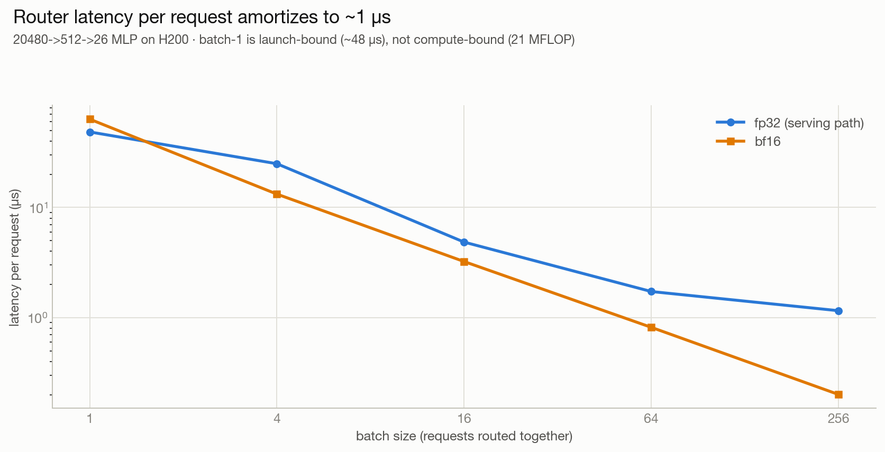

<!--
Blog-ready section — paste into Current_Blog.md, e.g. right after the router
accuracy chart in "Training a router between LoRA's". Charts already exist at
router/results26/charts/. Numbers measured on H200 (Modal),
scratchpad/bench_router26.py loading the real router26_mlp.pt.
-->

## How much does the router actually cost?

It's easy to *say* a router is cheap; here are the numbers. The router is a
2-layer MLP — `20480 -> 512 -> 26`, **10.5M parameters** — and the reason it's
nearly free isn't just that it's small. It runs **once per request**, on the
mean-pooled prompt feature that DFlash **already extracts** for the drafter
(target hidden states at layers [1, 9, 17, 25, 33]). So routing adds no extra
target prefill and no extra feature traffic — only one tiny MLP forward.

We measured that forward on an H200, loading the actual trained checkpoint and
timing it against a real Qwen3-8B target prefill on the same GPU:

At batch 1 the router takes **~48 µs** — about **0.1% of a single Qwen3-8B
prefill** (~47 ms). When requests are batched it amortizes to **~1 µs each**.
And because it fires only once per request while the target then runs hundreds
of decode steps, its share of end-to-end latency is smaller still.

Note the shape: at batch 1 the ~48 µs is **kernel-launch overhead, not
compute** — the actual arithmetic is only 21 MFLOP, well under 10 µs of H200
throughput — so the fixed dispatch cost simply amortizes away as the batch grows.

The full accounting, on every axis you might worry about:

| axis | router cost | in context |
|---|---|---|
| **Latency** | ~48 µs @ batch 1; ~1–5 µs/req batched | ~0.1% of one Qwen3-8B prefill (~47 ms) |
| **Compute** | 21 MFLOP / request | ~5 ppm of the prefill's FLOPs (16.4 GFLOP/token) |
| **Memory bandwidth** | reads 42 MB (fp32) of weights once per forward | vs. the target streaming 16 GB every decode step |
| **VRAM footprint** | 42 MB resident (21 MB in bf16) | +0.26% beside the 16 GB target |
| **Extra prefill / features** | none | reuses features DFlash already computes |

In short: the router is negligible on every axis — time, compute, bandwidth, and
memory — because it piggybacks on work the speculative-decoding stack is already
doing and only touches it once per request.
