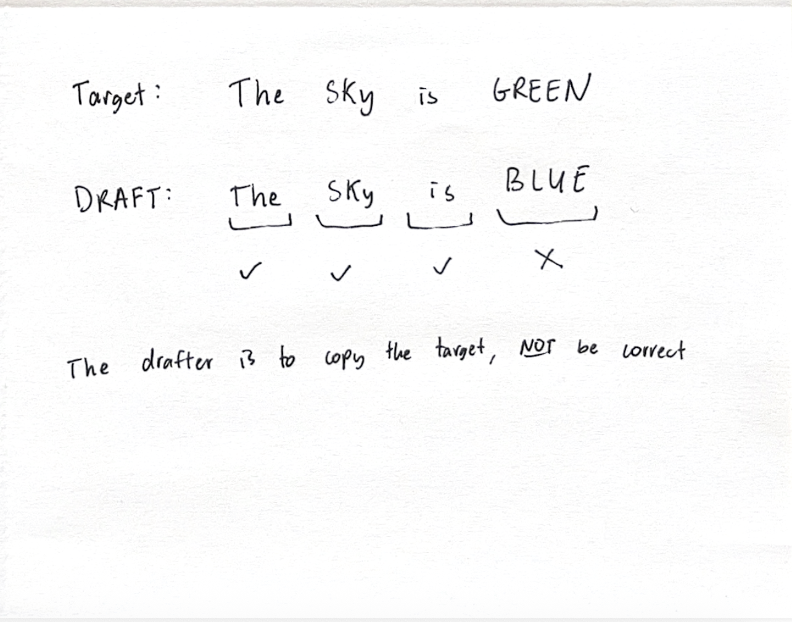
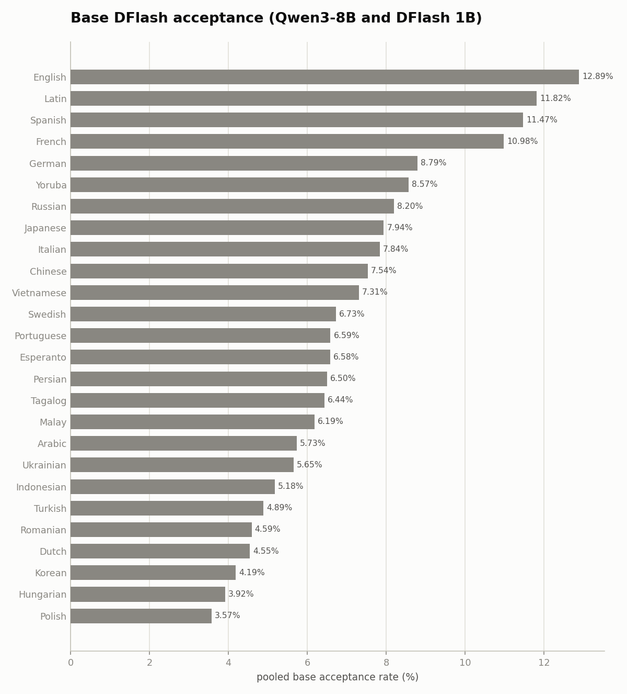
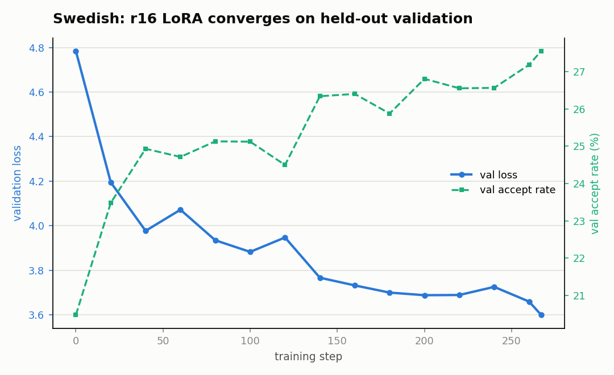
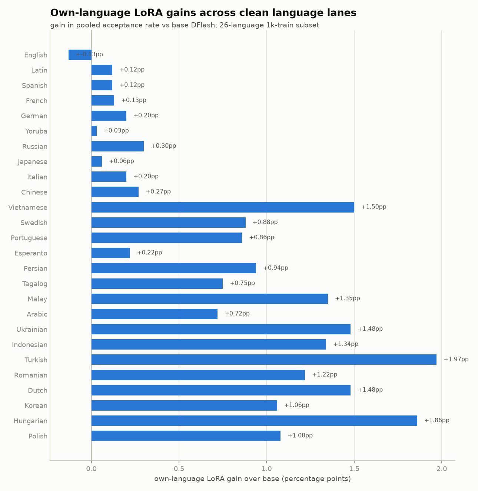
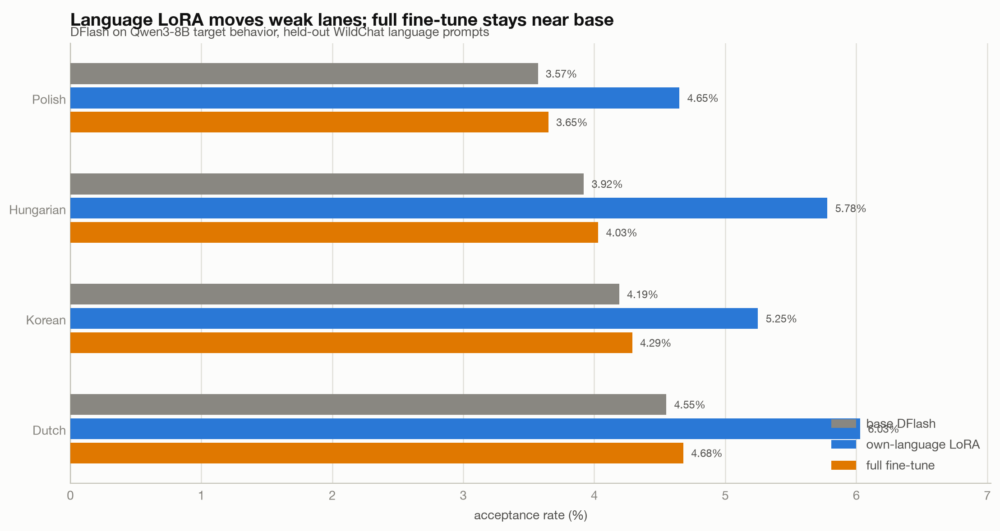
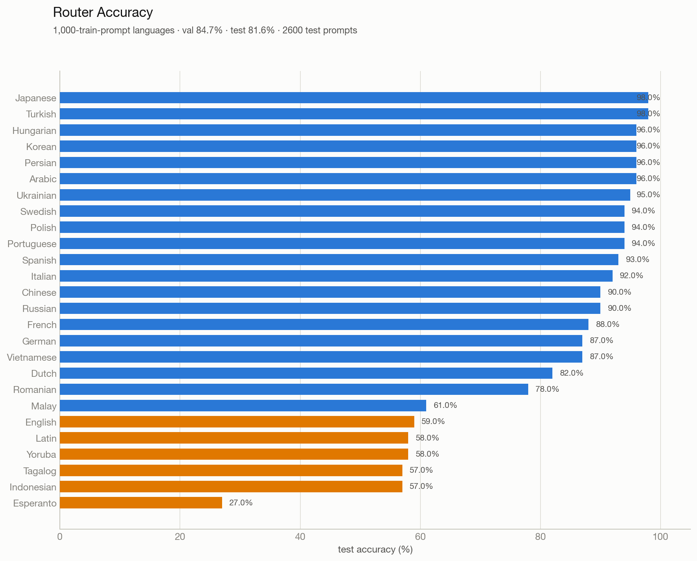
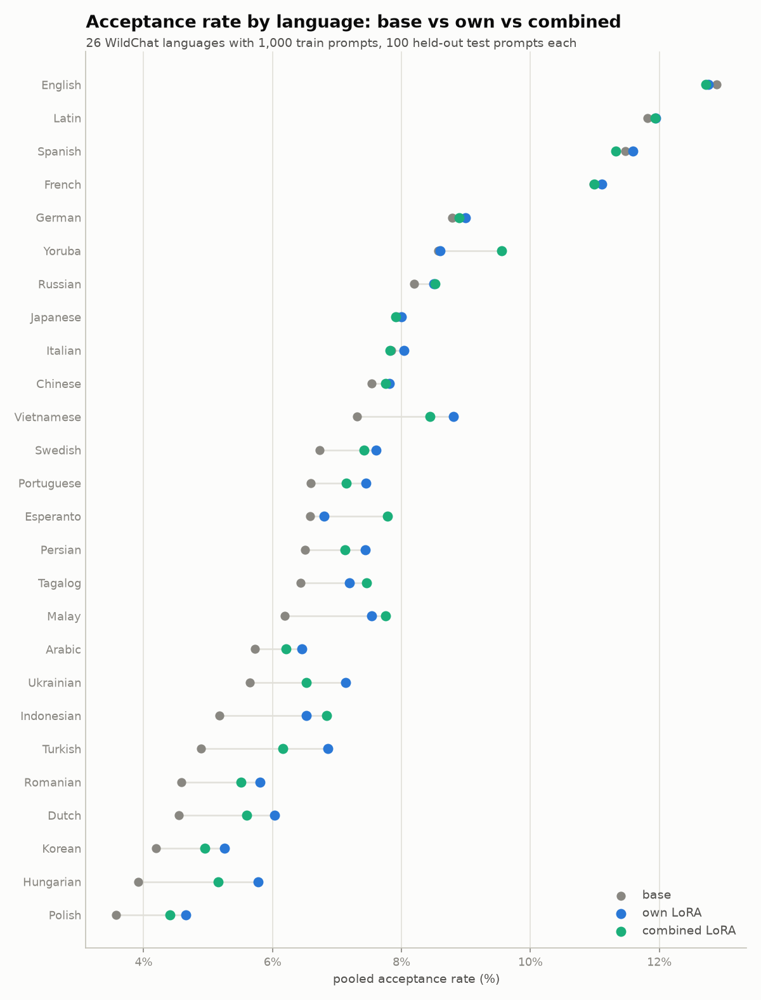
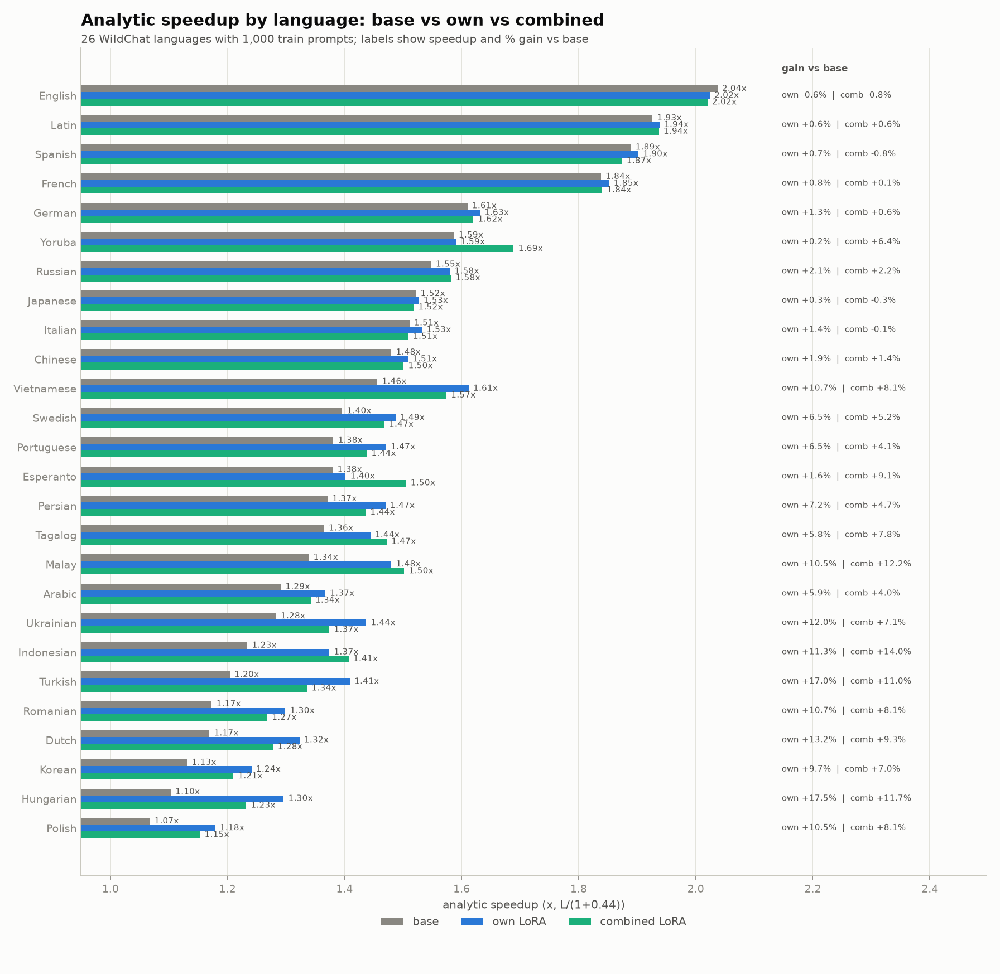
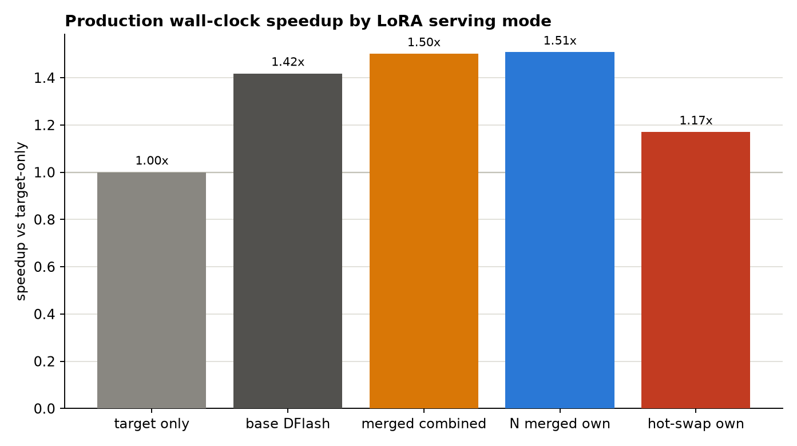

# Specialization is (sometimes) all Speculation needs

**TLDR:** We made speculative decoding 8% faster on aggragate and upwards of 46% faster on out of distribution languages by specializing block diffusion drafter models using LoRA. However, we find languages have low levels of interference and a singular combined LoRA captures almost all of the gains. We next hypothesize specialization will perform better in more fine-grained domains (future work) and has room to bring signicant speedups.

# What and why are we specializing?

Speculative decoding is an inference technique in which a draft model is used to propose multiple tokens for the target model to verify all at once, instead of the target model having to generate one token at a time sequentially. For more information about how speculative decoding works, [read this blog](https://jwlabs.vercel.app/post/speculative-decoding-first-principles).

You can think of the speculator (the drafter) as an approximation for the verifier (the target). An important detail is that the drafter is not trying to be correct in an external sense, but rather trying to copy the verifier.

We hypothesized that since the drafter is a small approximation of the larger verifier, it has to pick and choose what areas to have the best results. While common regions get modeled well, long-tail regions have gaps. If this is true, specializing the drafter should help us where the base drafter is weakest (out of distribution).

People have tried specialization for speculators in the past, but minimal or no work has been done on dynamic speculators, specializing diffusion speculators like DFlash, benchmarking at larger batch sizes, using unmerged LoRA/NaRA to serve many specializations at once, and comparing with combined/full finetunes. Below we experiment with different domains, different routing, and different trained adapters and see if they improve speculators.

# Speculators are uneven across languages

We first benchmarked the most popular speculator (z-labs/Qwen3-8b-DFlash-b16, a 1B block-diffusion drafter) for Qwen/Qwen3-8B across many languages.

We split WildChat 4.8M by language column and kept 26 languages with at least 1,200 usable prompts/conversations (1,000 train / 100 validation / 100 test split after deduplication). Then, we ran the target model and compared the acceptance rate on the 26 languages, producing the results below.

| language | base DFlash acceptance |
| :---- | :---- |
| Polish | 3.57% |
| Hungarian | 3.92% |
| Korean | 4.19% |
| Dutch | 4.55% |
| Romanian | 4.60% |
| Turkish | 4.89% |
| English | 12.90% |
| Latin | 11.85% |

We found that the speculator is extremely domain sensitive, supporting our hypothesis, having almost 4X variation in accuracy between the highest and lowest accurate languages.

It makes sense that languages such as English and Latin with the highest concentration of training data would perform the best where all languages like Polish and Hungarian with likely less training data would perform worse.

# Training Language-Specific LoRAs

LoRA is a process of fine tuning language models by freezing the original model weights and only training a small slice of the paramters (an additive adapter). This prevents the original model from forgetting any information and train with much less data.

We adapt this LoRA for block diffusion models by adding an adapter for all of the attention layers.

Using WildChat-4.8M, we split first-turn prompts by the dataset's language column, used up to 1,000 train / 100 val / 100 test prompts per language, and generated target answers greedily with Qwen/Qwen3-8B. 

For each train sequence, we capture the hidden states and the output of the target model. Using this data, we sample random positions (up to 48 times per sequence) in the sequence, and use this to train a rank 16 LoRA for the drafter.

The results show that clearly, specializing helps the model. 

| language | base | own LoRA | gain | relative |
| :---- | ----: | ----: | ----: | ----: |
| Swedish | 6.73% | 8.82% | **+2.09pp** | **+31%** |
| Turkish | 4.89% | 6.88% | +1.99pp | +41% |
| Hungarian | 3.92% | 5.72% | +1.80pp | +46% |
| Ukrainian | 5.65% | 7.23% | +1.58pp | +28% |
| Indonesian | 5.18% | 6.68% | +1.50pp | +29% |
| Dutch | 4.55% | 6.03% | +1.48pp | +33% |
| Vietnamese | 7.31% | 8.75% | +1.44pp | +20% |
| Malay | 6.19% | 7.60% | +1.41pp | +23% |
| Romanian | 4.59% | 5.88% | +1.29pp | +28% |
| Korean | 4.19% | 5.31% | +1.12pp | +27% |
| Polish | 3.57% | 4.66% | +1.09pp | +31% |
| Persian | 6.50% | 7.52% | +1.02pp | +16% |
| Portuguese | 6.59% | 7.46% | +0.87pp | +13% |
| Tagalog | 6.44% | 7.16% | +0.72pp | +11% |
| Arabic | 5.73% | 6.43% | +0.70pp | +12% |
| Russian | 8.20% | 8.61% | +0.41pp | +5% |
| Chinese | 7.54% | 7.85% | +0.31pp | +4% |
| German | 8.79% | 9.07% | +0.28pp | +3% |
| French | 10.98% | 11.24% | +0.26pp | +2% |
| Spanish | 11.47% | 11.68% | +0.21pp | +2% |
| Esperanto | 6.58% | 6.78% | +0.20pp | +3% |
| Italian | 7.84% | 8.00% | +0.16pp | +2% |
| Latin | 11.82% | 11.90% | +0.08pp | +1% |
| Japanese | 7.94% | 8.02% | +0.08pp | +1% |
| Yoruba | 8.57% | 8.61% | +0.04pp | +0% |
| English | 12.89% | 12.80% | −0.09pp | −1% |

We observed that the weaker languages got the largest gains. For example, Hungarian jumped **+46%** relative to its base. On the other hand, stronger languages like English actually got slowed down, probably because the base was already so strong. This supports the hypothesis that these models have the largest headroom in out-of-distribution regimes.

# LoRA beats a full fine tune

We next wanted to make sure that a full fine-tune does not vastly outperform the LoRA. So we used the same training data to train a full fine-tune of the model. Each domain’s full finetune performed *worse* than the LoRA

| language | base | own LoRA | own gain | full FT | full gain |
| :---- | :---- | :---- | :---- | :---- | :---- |
| Polish | 3.57% | 4.66% | \+1.09pp (+30.5%) | 3.66% | \+0.09pp (+2.5%) |
| Hungarian | 3.92% | 5.72% | \+1.80pp (+45.9%) | 4.04% | \+0.12pp (+3.1%) |
| Korean | 4.19% | 5.31% | \+1.12pp (+26.7%) | 4.30% | \+0.11pp (+2.6%) |
| Dutch | 4.55% | 6.03% | \+1.48pp (+32.5%) | 4.68% | \+0.13pp (+2.9%) |

We believe this is not showing that full fine-tune is bad or impossible, but rather that tuning all the paramters at once would require a lot more data to not be starved, whilst a limited rank-16 adapter (small % of total parameters) would converge much faster.

# Routing and the Combined LoRA

We trained a tiny sequence-level router over the same target-hidden features DFlash consumes. It chooses among language adapters plus a fallback bucket. The router got 100% validation accuracy and 100% test accuracy on the held-out router set. We did this over several of the worst languages.

![][image6]

We then tried all 26 languages as well, and found really good results again.  

(English here contains other stuff as well, like SQL, latin, etc)

This sounds amazing, but we realized that this was a red flag. If the model is able to perfectly separate languages internally, that means, there is no need for specialization (as it can already separate and learn the languages individually, no interference).

We tried an experiment of training a singular combined LoRA over all languages and compared the performance with the own LoRA.  

Looking at the net speedup per domain

labeled

Combined LoRA disproves specialization \**for this case.\** We believe because language is an easily separable task, it is largely FIRST a matter or more training data for out-of-distribution languages to improve the quality. When this saturates, then, perhaps our specialization will further shine.

# Serving Cost

There is two different ways of measuring the net speedup of the new speculators.

1. Theoretical analytical  
   We can predict from the increase in mean accepted length in proportion to the increased costs of speculating, the net speedup.  
   speedup \~= mean\_accept\_length / (1 \+ drafter\_overhead)

| mode | meaning |
| :---- | :---- |
| base | DFlash, no LoRA |
| merged\_combined | one combined language LoRA folded into DFlash weights |
| merged\_own | routed traffic to N already-merged language specialists |
| hotswap\_own | one drafter with unmerged per-language LoRA hot swapping |

The merged combined LoRA is the production path we care about: it is folded into the DFlash weights before decoding, so its serving path is the same as the base drafter.

| mode | tok/s | actual speedup vs target-only | relative vs base DFlash | accept | mean accept length |
| :---- | :---- | :---- | :---- | :---- | :---- |
| target-only | 46.78 | 1.000x | \- | \- | \- |
| base DFlash | 66.33 | 1.418x | 1.000x | 6.46% | 1.969 |
| merged combined LoRA | 70.23 | 1.501x | 1.059x | 7.17% | 2.076 |
| N merged own LoRAs | 70.55 | 1.508x | 1.064x | 7.33% | 2.099 |
| hot-swapped own LoRAs | 54.73 | 1.170x | 0.825x | 7.32% | 2.098 |

So the combined LoRA gives a \+5.9% wall-clock gain over base DFlash on this mixed-language serving stream, and the one-time merge setup was only 0.073s. The N-merged-specialist path gives \+6.4% over base DFlash, only about \+0.5% relative to the merged combined LoRA. In other words, for the clean language subset, the combined merged adapter gets almost all of the wall-clock benefit without serving N separate specialist drafters.  
The hot-swap result is the cautionary row. It gets essentially the same acceptance as the merged specialists, but drops to 54.73 tok/s, or 0.825x relative to base DFlash. The measured adapter-copy time was tiny, only 0.237s across 625 language switches; the slowdown comes from keeping the LoRA path unmerged inside the drafter forwards. For this workload, specialization only turns into serving speed when the adapter is merged into the drafter weights.

## **Conclusion**

For languages, specialization is almost all speculation needs.

## **Appendix And Future Ideas**

1. Trying with Eagle, independent drafter  
   1. We briefly tried, saw eagle has higher acceptance rate, but smaller proposal depth  
   2. Similar results  
2. Trying weird domains, in english like   
   1. Sql, etc  
   2. Showed way more intereference  
   3.  (legal, sql, etc, translation, poetry) preliminary results show  more intereference and more gians from indivudal LoRA but similar speedups  
3.  Rank ladder (prelimary results show languages much gains, other stuff not much) prob bc more to learn

We also did a quick sweep over a the LoRA rank to see if the depth of rank mattered. When doing LoRA, we take the model state as input, squeeze it down to r dimensions by A, then expand back out to B. Essentially, the rank becomes the width of the information bottleneck.

language	base	own r16	own r64
Polish	3.1%	4.4%	5.0%
Korean	3.5%	5.1%	5.8%
Italian	8.1%	8.5%	8.7%
Japanese	5.0%	5.9%	6.3%
German	6.8%	7.2%	7.3%

*(Rank sweep from the earlier 512-token-cap training run; numbers are directional. The trend is unaffected by the cap — retraining without truncation only raises the weak-language gains.)*

This shows us that higher rank helps the most on already weak languages where the model needs to not just align but actually learn new knowledge. On the other domains that already have knowledge, a smaller rank helps align the drafter to the target.