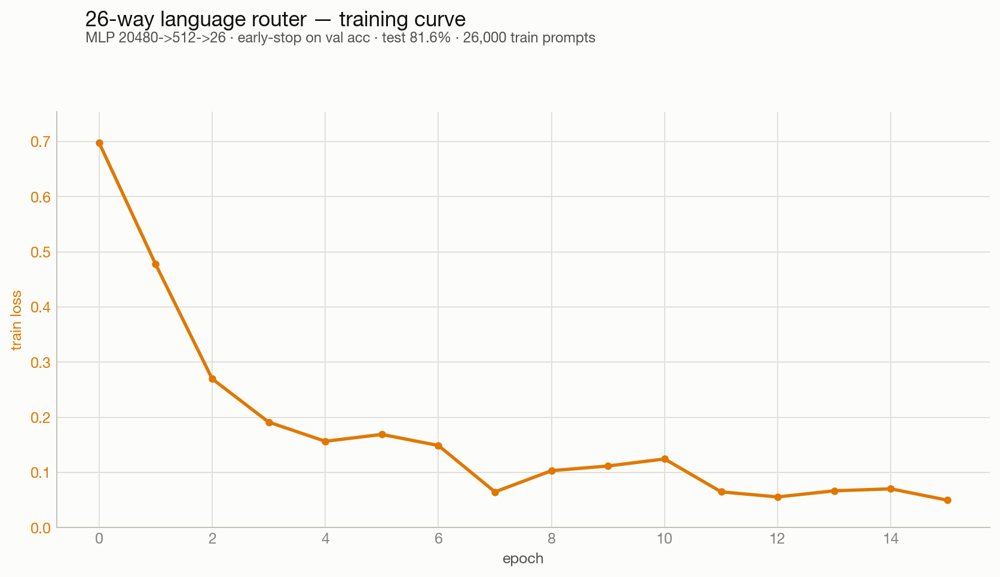
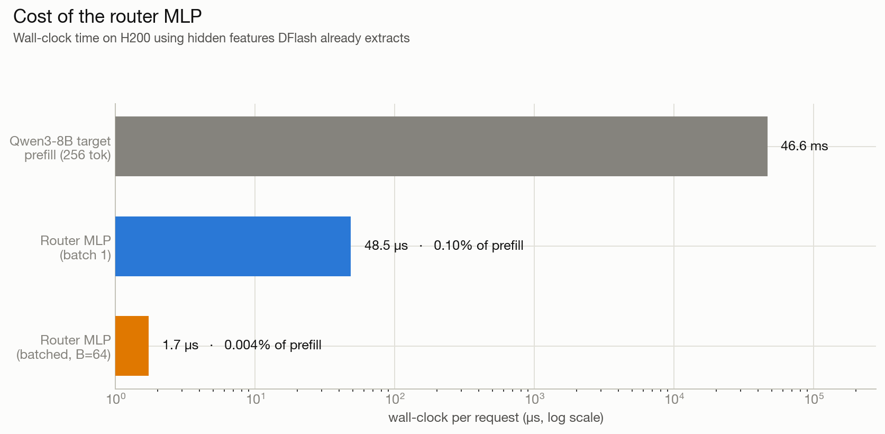
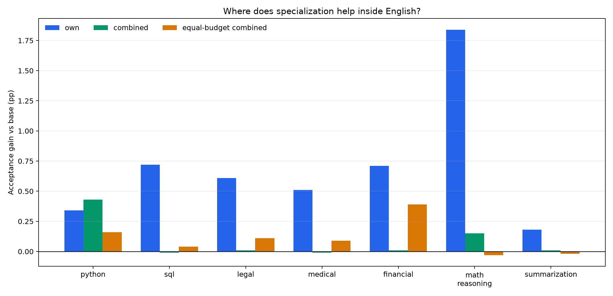
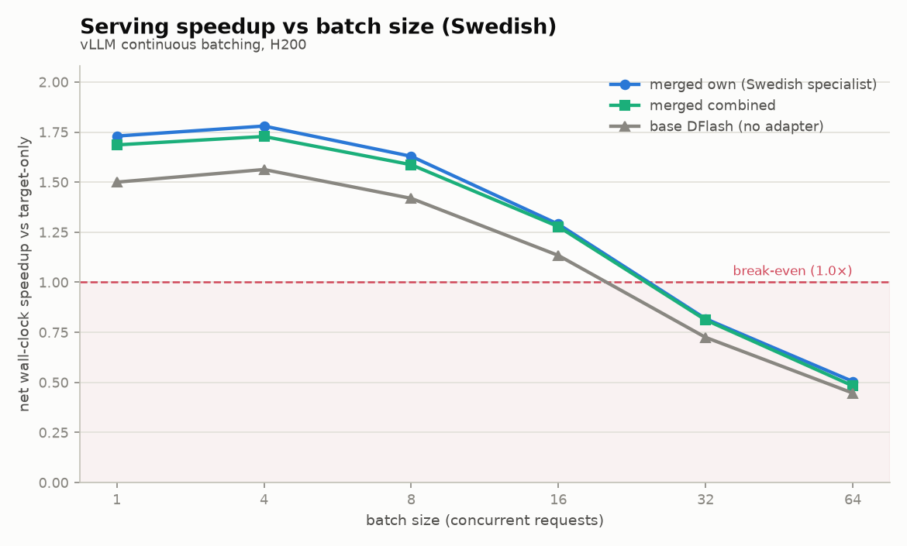
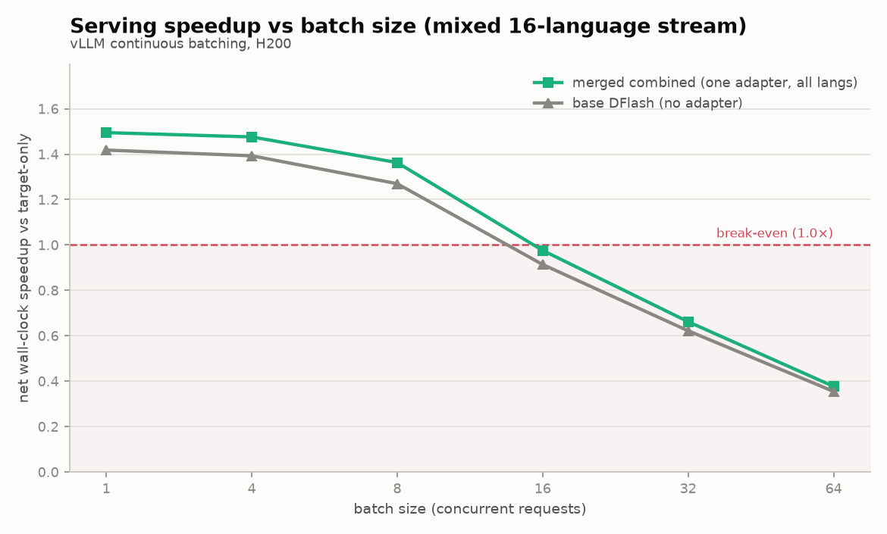

# Specialization is (sometimes) all Speculation needs

**TLDR:** We improved speculative decoding by up to 46% in acceptance rate on out-of-distribution languages, which translated to up to a 15.3% wall-clock speedup on those languages (and up to 7.3% on aggregate), by specializing block diffusion drafter models using LoRA. However, we find languages have low levels of interference and a single combined LoRA captures almost all of the gains. We next hypothesize specialization will perform better in more fine-grained domains (future work) and has room to bring significant speedups.

# What and why are we specializing?

Speculative decoding is an inference technique in which a draft model is used to propose multiple tokens for the target model to verify all at once, instead of the target model having to generate one token at a time sequentially. For more information about how speculative decoding works, [read this blog](https://jwlabs.vercel.app/post/speculative-decoding-first-principles).

You can think of the speculator (the drafter) as an approximation for the verifier (the target). An important detail is that the drafter is not trying to be correct in an external sense, but rather trying to copy the verifier.

We hypothesized that since the drafter is a small approximation of the larger verifier, it has to pick and choose what areas to have the best results. While common regions get modeled well, long-tail regions have gaps. If this is true, specializing the drafter should help us where the base drafter is weakest (out of distribution).

People have tried specialization for speculators in the past, but minimal or no work has been done on dynamic speculators, specializing diffusion speculators like DFlash for domain adaptation, benchmarking at larger batch sizes, using unmerged LoRA/NaRA to serve many specializations at once, and comparing with combined/full fine-tunes. Below we experiment with different domains, different routing, and different trained adapters to see if they improve speculators.

# Speculators are uneven across languages

We first benchmarked the most popular speculator (z-lab/Qwen3-8b-DFlash-b16, a 1B block-diffusion drafter) for Qwen/Qwen3-8B across many languages.

We split WildChat 4.8M by language column and kept 26 languages with at least 1,200 usable prompts/conversations (1,000 train / 100 validation / 100 test split after deduplication). Then, we ran the target model and compared the acceptance rate on the 26 languages, producing the results below.

| language | base DFlash acceptance |
| :---- | :---- |
| Polish | 3.57% |
| Hungarian | 3.92% |
| Korean | 4.19% |
| Dutch | 4.55% |
| Romanian | 4.60% |
| Turkish | 4.89% |
| English | 12.90% |
| Latin | 11.85% |

We found that the speculator is extremely domain sensitive, supporting our hypothesis, having almost 4X variation in accuracy between the highest and lowest accurate languages.

It makes sense that languages such as English and Latin, with the highest concentration of training data, would perform the best, while languages like Polish and Hungarian, with likely less training data, would perform worse.

# Training Language-Specific LoRAs

LoRA is a process of fine-tuning language models by freezing the original model weights and only training a small slice of the parameters (an additive adapter). This prevents the original model from forgetting information and requires much less data.

We adapt this LoRA for block diffusion models by adding an adapter for all of the attention layers.

Using WildChat-4.8M, we split first-turn prompts by the dataset's language column, used up to 1,000 train / 100 val / 100 test prompts per language, and generated target answers greedily with Qwen/Qwen3-8B.

For each train sequence, we capture the hidden states and the output of the target model. Using this data, we sample random positions (up to 48 times per sequence) in the sequence, and use this to train a rank-16 LoRA for the drafter.

The results clearly show that specializing helps the model.

| language | base | own LoRA | gain | relative |
| :---- | ----: | ----: | ----: | ----: |
| Swedish | 6.73% | 8.82% | +2.09pp | +31% |
| Turkish | 4.89% | 6.88% | +1.99pp | +41% |
| Hungarian | 3.92% | 5.72% | +1.80pp | +46% |
| Ukrainian | 5.65% | 7.23% | +1.58pp | +28% |
| Indonesian | 5.18% | 6.68% | +1.50pp | +29% |
| Dutch | 4.55% | 6.03% | +1.48pp | +33% |
| Vietnamese | 7.31% | 8.75% | +1.44pp | +20% |
| Malay | 6.19% | 7.60% | +1.41pp | +23% |
| Romanian | 4.59% | 5.88% | +1.29pp | +28% |
| Korean | 4.19% | 5.31% | +1.12pp | +27% |
| Polish | 3.57% | 4.66% | +1.09pp | +31% |
| Persian | 6.50% | 7.52% | +1.02pp | +16% |
| Portuguese | 6.59% | 7.46% | +0.87pp | +13% |
| Tagalog | 6.44% | 7.16% | +0.72pp | +11% |
| Arabic | 5.73% | 6.43% | +0.70pp | +12% |
| Russian | 8.20% | 8.61% | +0.41pp | +5% |
| Chinese | 7.54% | 7.85% | +0.31pp | +4% |
| German | 8.79% | 9.07% | +0.28pp | +3% |
| French | 10.98% | 11.24% | +0.26pp | +2% |
| Spanish | 11.47% | 11.68% | +0.21pp | +2% |
| Esperanto | 6.58% | 6.78% | +0.20pp | +3% |
| Italian | 7.84% | 8.00% | +0.16pp | +2% |
| Latin | 11.82% | 11.90% | +0.08pp | +1% |
| Japanese | 7.94% | 8.02% | +0.08pp | +1% |
| Yoruba | 8.57% | 8.61% | +0.04pp | +0% |
| English | 12.89% | 12.80% | −0.09pp | −1% |

We observed that the weaker languages got the largest gains. For example, Hungarian jumped **+46%** relative to its base. On the other hand, stronger languages like English actually got slowed down, probably because the base was already so strong. This supports the hypothesis that these models have the largest headroom in out-of-distribution regimes.

# LoRA beats a full fine-tune

We next wanted to make sure that a full fine-tune does not vastly outperform the LoRA. So we used the same training data to train a full fine-tune of the model. Each domain's full fine-tune performed *worse* than the LoRA.

| language | base | own LoRA | own gain | full FT | full gain |
| :---- | :---- | :---- | :---- | :---- | :---- |
| Polish | 3.57% | 4.66% | \+1.09pp (+30.5%) | 3.66% | \+0.09pp (+2.5%) |
| Hungarian | 3.92% | 5.72% | \+1.80pp (+45.9%) | 4.04% | \+0.12pp (+3.1%) |
| Korean | 4.19% | 5.31% | \+1.12pp (+26.7%) | 4.30% | \+0.11pp (+2.6%) |
| Dutch | 4.55% | 6.03% | \+1.48pp (+32.5%) | 4.68% | \+0.13pp (+2.9%) |

We believe this does not show that full fine-tuning is bad or impossible, but rather that tuning all the parameters at once would require a lot more data to avoid being starved, while a limited rank-16 adapter (a small percentage of total parameters) can converge much faster.

# Training a router between LoRAs
Additionally, we train a tiny router that uses the target-hidden features that DFlash uses anyway. The router is a 2-layer MLP that takes the hidden features (20480) to route between the 26 languages with 10.5M parameters, and since it is so small, its compute/time cost is basically negligible.

It scores very high, with 84.69% validation accuracy and 81.58% test accuracy:

(English here contains other stuff as well, like SQL, Latin, etc, which may be dragging down the score)

We wanted to make sure the router would not cause an increase in latency, but because it is so tiny compared to the actual model, the cost fully amortizes to almost nothing.

# Combined LoRA keeps a lot of the gains

Next, we wanted to see if the LoRA specialization was due to each adapter uniquely learning the domain, or just because it was exposed to more specific knowledge. The hint that told us to investigate this was that the hidden states cleanly separated the different languages well when routing between languages.

We also wondered if combining many languages could improve performance. Some languages come from the same family and carry semantic meaning that is complementary.

We tried an experiment of training a single "combined LoRA" over all the languages and compared its performance with the own-language LoRA.

Averaged over the 26 clean languages, the per-language specialists gain +0.85pp over base and the single combined adapter gains +0.70pp, a delta of just +0.15pp. The specialists win on most languages (19/26 languages), but the combined adapter is never far behind, and it actually wins on 6. We guess that the languages the combined model wins at (Esperanto, Yoruba, Tagalog, Malay, Indonesian, and Latin) are low-resource languages where cross-lingual transfer from related languages helps it generalize more than the specialized knowledge.

This implies that for cleanly separable domains, a single combined LoRA is sufficient. Training individual specialists is only necessary when the model cannot cleanly separate the task in its hidden state. Because language is an easily separable task, it is largely first a matter of adding more training data for out-of-distribution languages to improve the quality. When this saturates, then, perhaps our specialization will further shine.

# Interference gets real in more fine-grained domains

In domains in which the model has a hard time cleanly separating tasks, we experience the "muddling" of combined experts (more training data does not solve this; the small number of parameters means it muddles between 2 experts, and therefore needs specialization).

We tried cursory experiments (but leave the full experiments up for a follow-up blog).

First, we build an interference ladder that shows 10 combined domains vs 20 and 40 combined domains.

| combined adapter | mean gap vs own specialist | 95% CI | gain retained |
| :---- | ----: | :----: | ----: |
| 10 domains | −0.21pp | [−0.29, −0.13] | ~74% |
| 20 domains | −0.27pp | [−0.34, −0.20] | ~70% |
| 40 domains | −0.28pp | [−0.36, −0.19] | ~67% |

As you can see, as you increase the number of experts, the interference increases and specialists shine further.

Second, to prove that languages are easy and low interference, we try other English subdomains (code_python, code_sql, ood_legal, ood_medical, ood_financial, task_math_reasoning, task_summarization).

The per-domain specialists beat the base 7/7 as expected, but the key point is that the combined adapter only retains about 20% of the specialist gain. This is completely different from the language setting, where the combined LoRA retains most of the specialist gain.

# Serving Cost

We first compared all the different ways to serve the specialized drafter. Merging is a process in which you take the low-rank adapter LoRA weights and you mathematically multiply them with the existing weights to create a merged single set of weights as if it was just a new fine-tuned model. The benefit of keeping them unmerged is that you can keep most of the weights the same so you have a lower memory footprint because you just need to swap out your final adapter weights. As soon as you merge, then you need to keep multiple copies that are very similar but to the computer look entirely different.

We compared one merged model with the combined LoRAs, compared with multiple N individually merged specialized LoRAs, compared with N unmerged hot‑swappable LoRAs.

Because vLLM does not support hot swapping unmerged LoRAs, we tested this on HF.

| mode | meaning |
| :---- | :---- |
| base | DFlash, no LoRA |
| merged\_combined | one combined language LoRA folded into DFlash weights |
| merged\_own | routed traffic to N already-merged language specialists |
| hotswap\_own | one drafter with unmerged per-language LoRA hot swapping |

| mode | tok/s | vs target-only | vs base DFlash | acceptance | mean accept length |
| :---- | ----: | ----: | ----: | ----: | ----: |
| target-only | 46.78 | 1.000× | — | — | — |
| base DFlash | 66.33 | 1.418× | 1.000× | 6.46% | 1.969 |
| merged combined LoRA | 70.23 | 1.501× | 1.059× | 7.17% | 2.076 |
| N merged own LoRAs | 70.55 | 1.508× | 1.064× | 7.33% | 2.099 |
| hot-swapped own LoRAs | 54.73 | 1.170× | 0.825× | 7.32% | 2.098 |

This shows us that hotswapping LoRAs without optimizing this (punica styled batch kernels perhaps) is unworkable. On the other hand, merged-combined and N merged-own show promising results. Combined LoRA gives a \+5.9% wall-clock gain over base DFlash on this mixed-language serving stream, and the one-time merge setup was only 0.073s. The N-merged-specialist path gives \+6.4% over base DFlash, only about \+0.5% relative to the merged combined LoRA.

We tried on vLLM at different batch sizes on one of the best performing LoRAs (Swedish), which performed remarkable. Note that the batch size 1 result is different from above because we use vLLM and not HF.

All numbers below are net wall-clock speedup vs no speculative decoding (target-only).

| batch size | merged own | merged combined | base DFlash | merged own vs base |
| ----: | ----: | ----: | ----: | ----: |
| 1 | 1.73× | 1.69× | 1.50× | +15.3% |
| 4 | 1.78× | 1.73× | 1.56× | +14.1% |
| 8 | 1.63× | 1.59× | 1.42× | +14.8% |
| 16 | 1.29× | 1.28× | 1.13× | +14.2% |
| 32 | 0.82× | 0.81× | 0.73× | +12.3% |
| 64 | 0.51× | 0.48× | 0.45× | +13.3% |

At a higher batch size, even naive speculative decoding doesn't help anymore because we're no longer memory bound, but rather compute bound. But the cool thing to observe is that at these lower batch sizes, the Swedish specialist gives up to a 15.3% gain over the base DFlash, and the combined LoRA nearly matches it, plus 12% at batch size 1.

The benefit of merged-combined is that you only need 1 set of weights. It's essentially just the drafter with more knowledge. However, it's not specialized and may have interference (as we've somewhat shown).

The benefit of N-merged LoRAs is that you do not have any intereference and can have extreme specialization. The negative is that you now need to store more weights and this may perform poorly when constantly needing to swap in and out weights with heavy batch sizes. With larger batches (say size B), we will need to pull in potentially N different experts, instead of previously only needing to pull in 1 expert. Similar to the MOE speculation problem, this is bad because in an already memory bound system we are further hurting the memory pipe.

We then benchmarked using vLLM to see at different batch sizes with a "MIXED BAG" of different requests from different languages. This forced the model to use the combined merged LoRA and the speedups are shown below:

| batch size | merged combined | base DFlash | no spec decoding |
| ----: | ----: | ----: | ----: |
| 1 | 1.50× | 1.42× | 1.00× |
| 4 | 1.48× | 1.39× | 1.00× |
| 8 | 1.36× | 1.27× | 1.00× |
| 16 | 0.98× | 0.91× | 1.00× |
| 32 | 0.66× | 0.62× | 1.00× |
| 64 | 0.38× | 0.36× | 1.00× |

Even on a fully mixed stream, one combined adapter holds a +5–7% wall-clock edge over base DFlash across batch sizes (peaking at +7.3% around batch 8), with a single drafter and no routing. As before, the overall speedup still falls with batch, crossing break-even around batch 14.

We leave a future experiment to try to update the vLLM implementation and kernels to test how much slowdown hotswapping adapters or swapping entire drafters would cause within batches.

# Conclusion

For languages, specialization is almost all speculation needs. The core result is that a small LoRA can recover much of the drafter's long-tail weakness, and because language domains interfere surprisingly little, one merged combined LoRA captures nearly all of the specialist gain without the serving cost of hot-swapping adapters.

Speculation does indeed work, as we see recent work from [Modal](https://modal.com/blog/introducing-auto-endpoints) and [Baseten](https://www.baseten.co/blog/live-draft-model-training-for-speculative-decoding/) showing that production systems are moving toward per-customer or per-workload speculators. Our version is complementary because it trains lightweight LoRAs for each workload, then merges or routes them when useful, allowing you to serve many tenants from the same GPU pool without keeping a separate drafter for everyone.

We also think it is promising to try specializing in more niche domains, such as math and SQL, where it is important to align the drafter to the target model. We hope to post a follow-up blog that explores these niche domains more.

# Future Ideas
1. In this research, we try language domains and briefly experiment with more specialized fine‑grained domains within English, which show more interference and higher gains from specializing. We should further try this with more domains that are within more niche groups and see how they perform.

2. We should try other drafters, for example Eagle3, DSpark, and completely independent drafters, and test across larger models as well, not just 8B models, to see how they perform.

3. We should also try a quick sweep over low-rank adaptation ranks in other domains. From a brief examination of rank comparisons within languages, we found very little change between rank 16, rank 4, and rank 64 in terms of performance, which may also affect speedups because it reduces the amount of weights that need to be loaded into and from memory.
