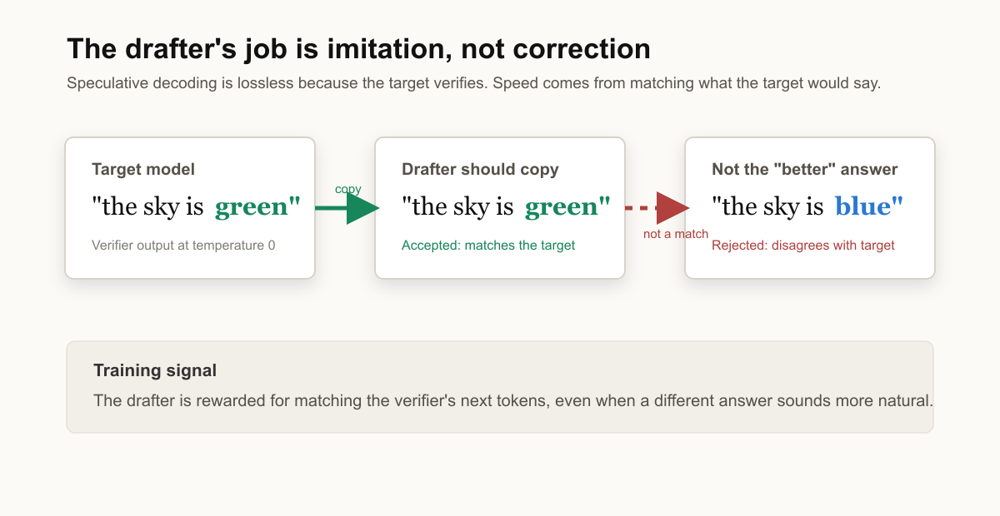
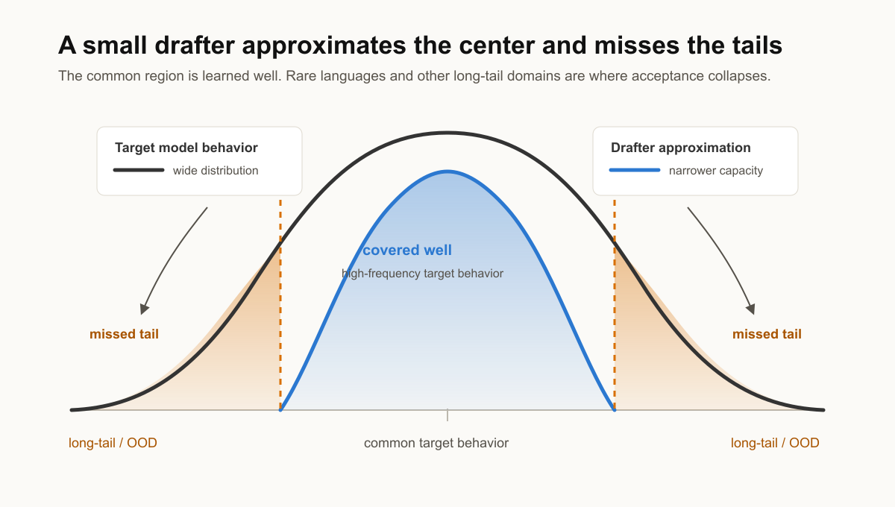
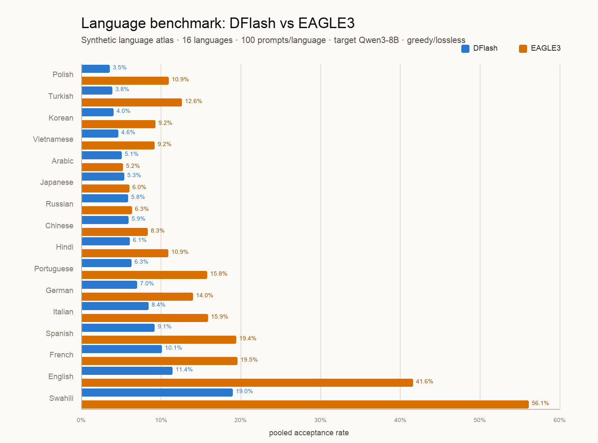
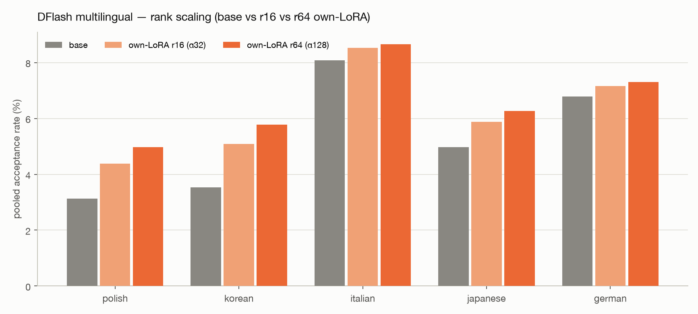
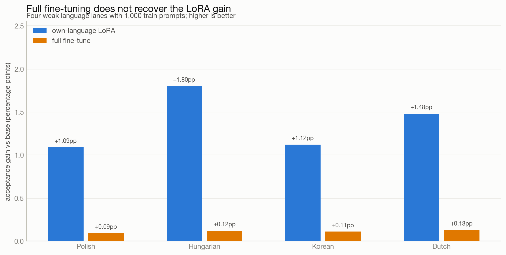
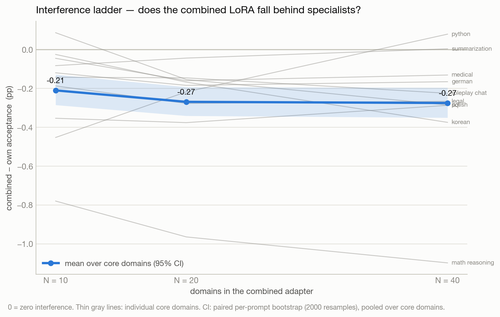
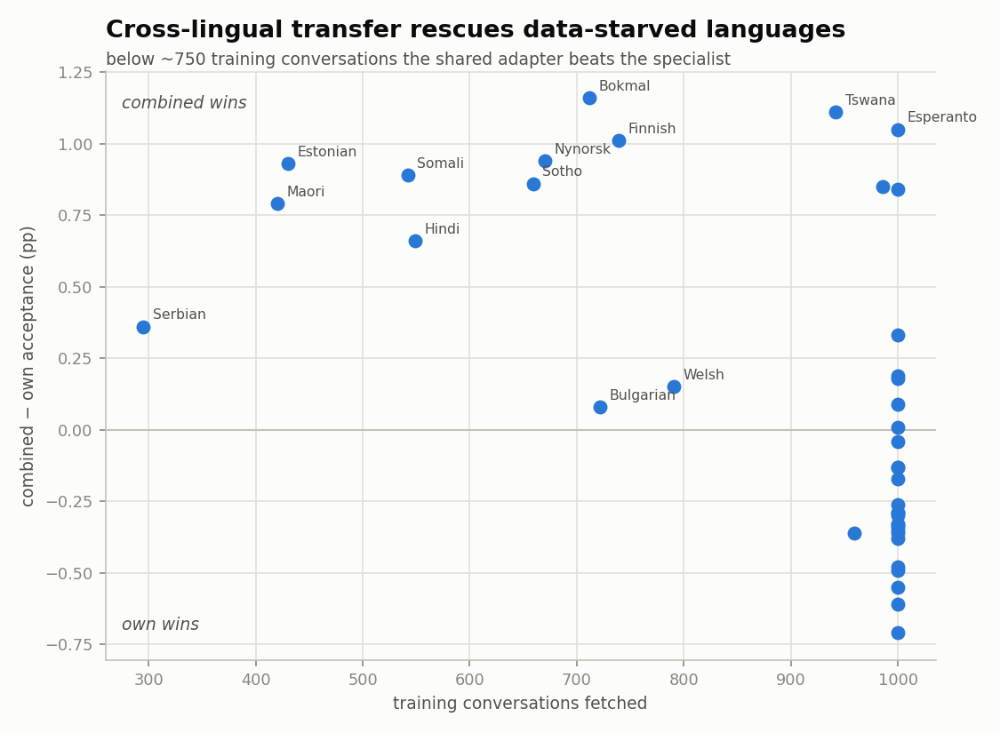
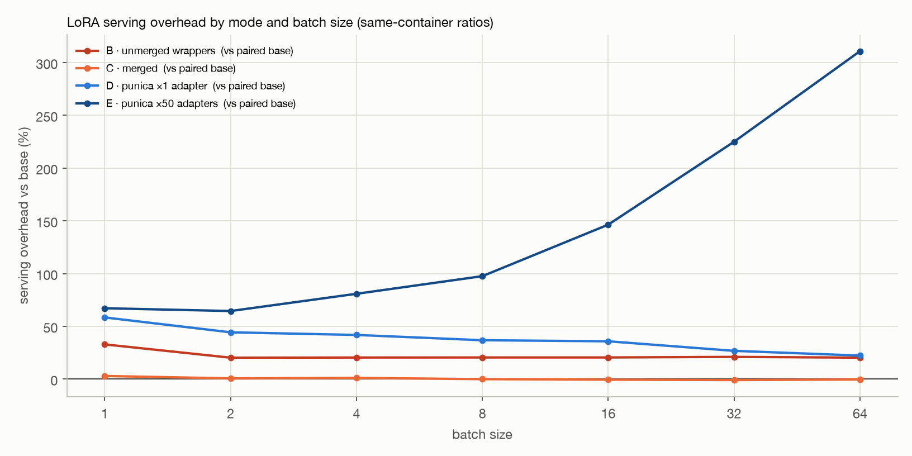

# Specialization Is (Almost) All Speculation Needs

**TLDR.** Speculative decoding gets its speed from a small drafter that copies a
big target model — and small drafters are worst exactly where the target is
speaking a rare language. We fix that with LoRA. For DFlash on `Qwen/Qwen3-8B`,
per-language rank-16 adapters lift acceptance most on the weakest lanes: Hebrew
**+52% relative** (4.2% → 6.4%), Hungarian **+46%** (3.9% → 5.7%), Turkish
**+41%** (4.9% → 6.9%), while English and French — already well-covered — gain
almost nothing. Three things surprised us. First, this is not a "train more parameters"
result: a rank-16 LoRA beat a *full* fine-tune of the drafter on every weak
language, and the full fine-tune barely moved off base. Second, routing is not
the production story we expected — one **combined** multilingual LoRA matches a
fleet of 40 per-language specialists (and beats them on data-starved languages
via cross-lingual transfer), so you rarely need to route. Third, acceptance is
science but throughput is systems: in a single-container H200 serving benchmark,
a **merged** combined LoRA takes DFlash from **1.418× → 1.501×** over target-only,
essentially tying 40 merged specialists at **1.508×** — while serving the same
adapters *unmerged* with hot-swapping drops to **1.170×**, slower than plain
DFlash, despite identical acceptance. The lesson: find where the drafter fails,
distill the target's behavior there, and **merge one adapter**.

---

## What we are specializing, and why

Speculative decoding is an inference trick: a small **draft** model proposes
several tokens at once, and the large **target** model verifies them all in a
single forward pass. Every token the target would have produced anyway is
committed for free, so the system emits multiple tokens per target step instead
of one. (For the mechanics from scratch, see our
[first-principles post](https://jwlabs.vercel.app/post/speculative-decoding-first-principles).)

The detail that matters for this whole post: the drafter is **not** trying to be
correct in any external sense. It is trying to *copy the verifier*. If the target
would say

> the sky is green

then a good drafter says "the sky is green" — even though "the sky is blue" is
more plausible. Speculative decoding only rewards matching the target. And
because the target always verifies, the output is provably **lossless**: at
temperature 0 the emitted text equals the target's greedy generation regardless
of how good or bad the drafter is. The adapter changes speed, never correctness.
Across every experiment below, the exact-match rate against plain target decoding
is byte-identical for base, LoRA, and full fine-tune.



The single number that measures "how well does the drafter copy the target on
this domain" is the **acceptance rate**: accepted draft tokens ÷ proposed draft
tokens. It is the only fair way to compare drafters, because it normalizes for
how many tokens each proposes per step (DFlash proposes 15, EAGLE3 proposes 3, a
vanilla independent drafter proposes *k*). Acceptance is what fine-tuning moves.
A second number, **mean accept length** (tokens committed per target forward
pass), is a within-drafter speed proxy but has different ceilings per
architecture, so we lead with acceptance and treat length/wall-clock as the
downstream consequence.

### Two hypotheses

**Hypothesis 1 — capacity and the long tail.** A public drafter is a ~1B
approximation of an 8B verifier. It cannot model the target everywhere, so it
spends its capacity on common regions and clips the tails. If that is true,
specializing the drafter should help *most* where the base drafter is *weakest*.



**Hypothesis 2 — interference.** If you want to serve many domains, you could
train one adapter per domain and route, or train a single adapter on everything.
The folklore says one-adapter-for-all should get muddy: domains fight over the
same low-rank weights, and specialists + a router should win. We set out to
confirm this. It survives only in a weak form.

Prior work has specialized speculators, but little has been done on **block-
diffusion** drafters like DFlash, on serving **unmerged** adapters at scale, on
measuring interference as a function of domain count, or on directly pitting a
combined adapter against a routed specialist fleet. That is the gap we work in.

---

## Speculators are uneven — and the weak spot is language

We started by benchmarking the two strongest public speculators for `Qwen/Qwen3-8B`
across 51 synthetic domains:

- **DFlash** (`z-lab/Qwen3-8B-DFlash-b16`) — a ~1B block-diffusion drafter that
  proposes a block of ~15 tokens per step.
- **EAGLE3** (`RedHatAI/Qwen3-8B-speculator.eagle3`) — a single-layer
  autoregressive head that proposes 3 tokens per step.

The base atlas is stark. DFlash acceptance spans **4.0% → 38.5%** across domains;
EAGLE3 spans **5.2% → 63.3%**. And the ranking is the same for both: math and
structured tasks (JSON extraction, tabular data) sit on top; **non-Latin-script
languages sit at the bottom.** For these Qwen3 drafters, "out of distribution"
does not mean an exotic *topic* — code, legal, medical, and chemistry all draft
fine — it means the *script the target is speaking*.

| group (synthetic) | DFlash acceptance | EAGLE3 acceptance |
|---|---:|---:|
| languages (16) | 7.2% | 16.3% |
| coding (15) | 18.5% | 45.2% |
| tasks (11) | 19.6% | 44.8% |
| specialized / OOD (9) | 16.1% | 42.7% |



EAGLE3 accepts 2–3× more per proposal than DFlash but is capped at 4 tokens per
pass; DFlash accepts less but proposes 15, so it commits more per pass. They are
not directly comparable on raw acceptance — but both agree on *where the headroom
is*. The prize is languages, so that is where we specialized. We use DFlash for
the main story because it is weak across the board and therefore has the most to
teach us about specialization; EAGLE3 returns as a cautionary tale later.

To make this a real experiment rather than a synthetic one, we moved to
**WildChat-4.8M** — 3.2M real conversations across 75 detected languages (English
52%, Russian 11%, Chinese 8%, French 5%, …). We split first-turn prompts by the
dataset's language column and kept the languages with enough data, generating
target answers greedily with `Qwen/Qwen3-8B` so the drafter learns the target's
*actual* conditional distribution — including its mistakes — rather than any
dataset gold answer. This **self-distillation** is what makes the drafter copy
the verifier instead of the corpus.


DFlash does not degrade smoothly — the weakest WildChat lanes are several times
worse than English:

| language | base DFlash acceptance |
|---|---:|
| Polish | 3.57% |
| Hungarian | 3.92% |
| Korean | 4.19% |
| Hebrew | 4.23% |
| Dutch | 4.55% |
| Romanian | 4.60% |
| Turkish | 4.89% |
| … | … |
| Latin | 11.85% |
| English | 12.90% |

---

## Training language-specific LoRAs: the headroom law

For each language we trained one **rank-16 LoRA** (α=32) on the drafter's
`q/k/v/o` projections. The recipe:

1. Fetch WildChat prompts by language.
2. Generate target answers greedily with `Qwen/Qwen3-8B` (self-distillation).
3. Capture the target's hidden states at layers `[1, 9, 17, 25, 33]` — the same
   features DFlash already conditions on.
4. Train one rank-16 LoRA per language (1,000 train / 100 val / 100 test prompts).
5. Benchmark base vs the matching LoRA on held-out prompts.

Training uses the **full conversation** (no sequence-length truncation): the loss
is anchored on the response tokens, which sit at the end, so truncating long
prompts would silently drop those examples — and it does so worst on exactly the
tokenizer-heavy languages this post is about (Devanagari/Hebrew/Yoruba cost 2×+
tokens, so a 512-cap discarded up to ~50% of a language's response tokens). All
headline numbers below are trained on the untruncated data.

The result matched Hypothesis 1 exactly, and cleanly enough to name:

> **The headroom law.** LoRA gain is inversely proportional to how strong the
> base drafter already is on that domain. Specialization is easy exactly where
> speculation is slow.

The weakest lanes move the most; the strongest lanes don't move at all.

| language | base | own-language LoRA | gain | relative |
|---|---:|---:|---:|---:|
| Polish | 3.57% | 4.66% | +1.09pp | +30.5% |
| Hungarian | 3.92% | 5.72% | +1.80pp | +45.9% |
| Korean | 4.19% | 5.31% | +1.12pp | +26.7% |
| Hebrew | 4.23% | 6.44% | +2.21pp | +52.2% |
| Dutch | 4.55% | 6.03% | +1.48pp | +32.5% |
| Romanian | 4.59% | 5.88% | +1.29pp | +28.1% |
| Turkish | 4.89% | 6.88% | +1.99pp | +40.7% |
| … | | | | |
| English | 12.89% | 12.80% | −0.09pp | ~0% |
| French | 10.98% | 11.24% | +0.26pp | +2.4% |


This is the core specialization result: the bad lanes get several tokens of
extra mean accept length, the good lanes were already saturated. Nothing is lost
where the gain is zero — English simply had no headroom to give.

### How much capacity does specialization actually need?

Because the effect is a "steering" correction rather than new knowledge, it lives
in a very low-rank subspace. We swept adapter rank on DFlash:

| language | base | own r16 | own r64 |
|---|---:|---:|---:|
| Polish | 3.1% | 4.4% | 5.0% |
| Korean | 3.5% | 5.1% | 5.8% |
| Italian | 8.1% | 8.5% | 8.7% |
| Japanese | 5.0% | 5.9% | 6.3% |
| German | 6.8% | 7.2% | 7.3% |



Two takeaways. On heterogeneous non-language domains (translation, roleplay,
poetry), a **rank-4** adapter — ~130K params, 0.01% of the drafter — already
captures ≈90% of the achievable gain, and rank saturates by 16. But on the
*weakest* language lanes (3–5% base), higher rank keeps paying: r64 buys another
+0.6–0.7pp beyond r16 on Polish and Korean (+61–66% relative over base). **Rank
need scales with the size of the deficit.** Default recipe: r16 everywhere, r64
only for the languages the base drafter is nearly useless on.

---

## LoRA beats a full fine-tune — and it isn't close

The obvious objection: maybe LoRA isn't the point, and fully fine-tuning the
drafter would do at least as well. So on the five weakest WildChat language lanes
we trained a *full* DFlash fine-tune on the same frozen target-hidden shards the
LoRAs used, and benchmarked head-to-head.

| language | base | own LoRA | own gain | full FT | full gain |
|---|---:|---:|---:|---:|---:|
| Polish | 3.57% | 4.66% | +1.09pp (+30.5%) | 3.66% | +0.09pp (+2.5%) |
| Hungarian | 3.92% | 5.72% | +1.80pp (+45.9%) | 4.04% | +0.12pp (+3.1%) |
| Korean | 4.19% | 5.31% | +1.12pp (+26.7%) | 4.30% | +0.11pp (+2.6%) |
| Hebrew | 4.23% | 6.44% | +2.21pp (+52.2%) | 4.71% | +0.48pp (+11.3%) |
| Dutch | 4.55% | 6.03% | +1.48pp (+32.5%) | 4.68% | +0.13pp (+2.9%) |



The LoRA moved the drafter; the full fine-tune stayed glued to base. Averaged
over these lanes, own-language LoRA gained **+1.54pp**, full fine-tuning **+0.19pp**.
We saw the same thing earlier on non-language domains — SQL (**base 25.0% → LoRA
28.3%**, full FT 25.1%) and Indian legal (**10.9% → 13.5%**, full FT 11.1%).

This is not "full fine-tuning can never work." It is a data-scale statement:
moving a billion parameters with a couple million supervised tokens is starved,
while a rank-16 adapter has exactly the right inductive bias for a low-rank
steering correction and converges on the little data we have. At the scale where
specialization is worth doing, **LoRA is the right lever and the whole drafter is
the wrong one.**

---

## Interference is real, but small — and it saturates

If specialists are cheap, the natural production idea is: train one per domain,
build a router, and serve the fleet. We expected interference to force this. It
mostly didn't.

First, does one combined adapter get muddy? We built an interference ladder on
DFlash: 10 core specialist domains, then one combined adapter trained over 10,
20, and 40 domains (the extra domains are distractors that keep per-domain data
constant, so the combined-minus-own gap on the core 10 is a clean interference
read-out).

| combined adapter | mean gap vs own specialist | 95% CI | gain retained |
|---|---:|:--|---:|
| 10 domains | −0.21pp | [−0.29, −0.13] | ~74% |
| 20 domains | −0.27pp | [−0.34, −0.20] | ~70% |
| 40 domains | −0.28pp | [−0.36, −0.19] | ~67% |



At N=3 and N=5 the gap is statistically zero. It first becomes measurable at
N≈10 (the CI excludes zero), then **saturates** — going from 20 to 40 domains
costs another ~0.01pp. There is no phase boundary through 40 domains; the
combined adapter beats base on 10/10 core domains at every N. And the tax
concentrates exactly where specialization pays most: at N=40, math reasoning
gives back −1.1pp of its +2.0pp specialist gain, while low-gain domains give back
nothing. The interpretation: the broad steering direction is shared for free;
only the largest domain-specific shifts compete for the shared subspace.

Now the language version, at full scale. Over all **40 WildChat languages**, one
combined multilingual LoRA doesn't just match the 40-specialist fleet — it edges
it: mean acceptance gain vs base is **+0.84pp for combined vs +0.70pp for own**,
and combined wins on exactly half the languages (20 of 40). The reason is the nice
surprise:

> **Cross-lingual transfer rescues data-starved languages.** The combined adapter
> beats its own specialist on nearly every language that fetched short — Estonian
> (430 records, 4.6% → 6.0%), Nynorsk, Bokmål, Tswana, Sotho, Somali, Finnish,
> Maori, Serbian. The specialists win only on data-rich, distinct languages
> (Turkish, Ukrainian, Persian, Vietnamese, Swedish).



On the clean 26-language subset (1,000 train prompts each, no data-starvation
effect) the specialists edge back ahead, but only just: own **+0.85pp** vs
combined **+0.70pp** mean acceptance, with the combined adapter still winning 7 of
26 languages.


Either way, the story is cleaner than "route to specialists":

> For language specialization, the main win is not picking the right adapter. It
> is adding target-distilled language coverage to the drafter at all. One
> combined adapter captures nearly the entire benefit.

---

## Do we even need a router?

We still built one, because it is almost free. DFlash already runs the target's
prefill and conditions on its hidden states; a router can read *exactly that
tensor* (mean-pooled, 20480-dim) through one tiny MLP — no extra model, no extra
forward pass.

- **5 languages + an "other" bucket:** 100% validation / 100% test accuracy. But
  this was a smoke test on clean, script-distinct lanes.
- **26-way (clean subset):** 84.7% val / **81.6% test**.
- **40-way (every WildChat lane):** 74.0% val / **68.8% test**.


The accuracy degrades gracefully with class count, and — importantly — the errors
are *linguistically sensible*, never random. Turkish, Japanese, Arabic, Persian,
Korean, and Hungarian route at 96–98%. The floor is Esperanto (27%), a
constructed Romance-Germanic blend that scatters into Yoruba and Malay. The
biggest single confusion is Indonesian ↔ Malay — two mutually intelligible
languages that collapse into each other (Indonesian routes to Malay 39% of the
time). And tellingly, **English lands at only 59%**: many "English" WildChat rows
are really code, spreadsheets, Bible commentary, or mixed-script prompts, and
they leak into the noisy Latin and Tagalog buckets. English being hard is the
giveaway that this is not clean language ID — WildChat's labels carry
related-language ambiguity, mixed-language prompts, and detector noise.

So the router works and is cheap, but the combined-LoRA result above means we
rarely need it for language specialization. Its real uses are tenant isolation,
open-set fallback, and future acceptance-aware routing — not squeezing out the
last +0.11pp.

---

## Where specialization gets harder: finer domains and MoLE

Languages turn out to be an *easy*, low-interference axis — cleanly separable,
big shared steering direction. Push to finer-grained domains inside English and
the picture shifts.

Across seven English subdomains (`code_python`, `code_sql`, `ood_legal`,
`ood_medical`, `ood_financial`, `task_math_reasoning`, `task_summarization`),
per-domain specialists beat base on **7/7** — math reasoning gained the most
(+1.8pp, 37.6% → 39.4%). But the single combined adapter retained only about
**20%** of the specialist gain, and a data-matched control retained ~18%, so it
is not a data-quantity effect — one adapter simply cannot be a specialist for all
of these at once.


We also tried to *learn* the routing rather than label it, with a
mixture-of-LoRA-experts (MoLE): 8 rank-8 experts plus a latent gate over the same
pooled context feature, trained end-to-end on the unlabeled wild pool. The gate
**collapsed to uniform** — every one of 16 domains produced essentially the same
expert blend (per-sample entropy 2.07 nats ≈ ln 8, top expert always the same).
No emergent domain decomposition. Amusingly, MoLE was still the best *mean*
variant (+0.30pp), but only because a uniform ensemble of 8 small adapters
slightly out-averages one monolithic rank-64 adapter — an ensemble effect, not
specialization.

The honest framing: **specialization helps, but interference depends on the
axis.** Languages are low-interference (one combined adapter is enough); finer
English task/domain mixtures are higher-interference (specialists pull ahead).
That is the seed of a follow-up post.

---

## A cautionary tale: the train–serve alignment tax

DFlash specialized on the first try. EAGLE3 fought us for three days — and the
story is worth telling because it is the real risk in specializing feature-
conditioned drafters.

Our early EAGLE runs showed language LoRAs *failing*. We nearly concluded "the
strong feature-conditioned head resists specialization." It was bugs, all in the
seam between training and serving:

1. **Reversed features (v1).** A variable-shadowing bug meant training fed the
   head aux features in order `[33,18,2]` while serving used `[2,18,33]`. The
   adapters were trained to fight a scrambled input.
2. **Unshifted TTT (v2).** The training forward fed inputs, aux features, and
   targets *unshifted*, so the LoRA learned to predict token *t+1* from features
   at *t* while serving predicts *t+2*. Every adapter *improved its training
   objective while degrading serving acceptance* — a one-position slip that
   silently inverts the result (own lost to base on 7/8 domains, −1.3 to −4.0pp).

With the canonical `shift_batch` alignment restored (v3), EAGLE specializes
cleanly: own beats base on **5/5** languages (+0.6 to +2.1pp), the combined
adapter beats base 5/5 and ties or beats own everywhere — zero interference — and
the gains track headroom (Japanese, 4.9% base, gains +2.1pp = +43% relative). The
diagnostic that now gates any change: train-time step-0 top-1 accuracy must match
the serving position-1 acceptance implied by the base benchmark.

The general lesson:

> **Feature-conditioned drafters buy cheap drafts at the price of a fragile
> training contract; independent drafters buy a trivial training contract at the
> price of expensive drafts.**

We saw the other side of that trade with a vanilla independent drafter
(`Qwen3-0.6B` for the 8B target, plain cross-entropy self-distillation, nothing
to misalign). It posted the *largest per-proposal gains in the whole project* —
own beat base on 5/5 domains by +2.6 to +5.5pp, including +2.6pp on a domain
where the base already accepted 77%. That breaks the pure-headroom reading:
strong base alone does not kill specialization; a leaky alignment channel does.
But at batch 1 it *loses on wall-clock* (0.58–0.97× target-only): a 28-layer 0.6B
forward costs almost as much as the 36-layer 8B target's, so drafting is
latency-bound. That is precisely the niche single-forward (DFlash) and
single-layer (EAGLE) drafters exist to fill.

---

## Serving cost: acceptance is science, throughput is systems

Everything above is acceptance. The product question is wall-clock. There are two
speedup numbers and they must be labeled separately.

**The analytic model.** We can predict wall-clock from acceptance:

```text
speedup ≈ mean_accept_length / (1 + c)
```

where `c` is the drafter's per-step overhead in target-forward units — a
per-speculator, per-engine constant. Fitted values: EAGLE3 on vLLM `c ≈ 0.18–0.24`,
DFlash on HF `c ≈ 0.44`, the independent 0.6B drafter `c ≈ 3` (which is why it
loses). Given `c`, this model predicts measured wall-clock to **0.3–2% median
error** on paired benchmarks — so once you know `c`, future experiments can skip
baseline runs and report `L/(1+c)`. The one section it predicted poorly (6% error)
ran its baseline in a different container days later; the lesson is **pair your
baselines in-container** — HF batch-1 timing drifts tens of percent across hosts.

**The measured production benchmark.** To get an honest wall-clock number we ran
all serving modes in *one* H200 container on a worst-case mixed stream: 26
languages × 25 prompts = 650 prompts with **624 language switches**.

| mode | tok/s | vs target-only | vs base DFlash | accept | mean len |
|---|---:|---:|---:|---:|---:|
| target-only | 46.78 | 1.000× | — | — | — |
| base DFlash | 66.33 | 1.418× | 1.000× | 6.46% | 1.969 |
| merged combined LoRA | 70.23 | 1.501× | 1.059× | 7.17% | 2.076 |
| N merged own LoRAs | 70.55 | 1.508× | 1.064× | 7.33% | 2.099 |
| hot-swapped own LoRAs | 54.73 | 1.170× | 0.825× | 7.32% | 2.098 |


Three things fall out of this table.

1. **The merged combined LoRA is the production path.** It gives **+5.9% wall-clock
   over base DFlash** on a mixed-language stream, and the one-time merge costs
   0.073s. The 40-specialist oracle (each folded into weights) is only +0.5%
   faster still — for the clean language axis, one merged adapter gets essentially
   all the benefit without serving N drafters.
2. **Higher acceptance does not imply higher throughput.** The hot-swap row has
   the *same* acceptance as the merged specialists (7.32% vs 7.33%) yet runs at
   0.825× base DFlash — 17.5% *slower* than using no adapter at all. The swaps
   themselves are free (625 of them cost 0.256s total, **0.41ms each, 0.012% of
   wall-clock** — an r16 adapter is only ~7MB). The cost is keeping the LoRA path
   *unmerged* inside every drafter forward.
3. **Merging is what turns specialization into speed.**

A dedicated adapter-serving sweep (with zero-delta adapters, so timing only)
confirms the mechanism and the danger:

| serving mode | overhead @ batch 1 | overhead @ batch 64 |
|---|---:|---:|
| merged delta weight | +3.0% | −0.4% |
| unmerged HF wrappers | +32.9% | +20.4% |
| vLLM Punica, 1 adapter | +58.5% | +22.3% |
| vLLM Punica, 50 adapters | +67.2% | **+310.8%** |



Merging is free at every batch size. Unmerged wrappers cost a flat ~20% tax that
never amortizes. And the killer is adapter *diversity* per batch: serving 50
distinct adapters in one batch blows up to **+311% overhead at batch 64**. So the
"one specialist per user, all batched together" dream is expensive. The recipe
that actually serves fast is the boring one: **one combined LoRA, merged into the
drafter weights.**

---

## Conclusion

For languages, specialization is almost all speculation needs.

The public drafter is weakest on the long language tail; target-distilled LoRAs
patch that weakness exactly in proportion to how weak it was. But the cleanest
production result is simpler than a mixture of routed specialists: one combined
multilingual adapter captures nearly the entire gain — and beats specialists
outright on data-starved languages via cross-lingual transfer — as long as it is
**merged** into the drafter before serving. The recipe:

1. Find where the drafter fails (benchmark acceptance per domain).
2. Distill the target's behavior in that region (self-distillation, LoRA — not a
   full fine-tune, not more parameters).
3. If the specialization axis is low-interference (like languages), train *one*
   combined adapter instead of a fleet.
4. Merge it into the drafter weights. Only route unmerged specialists when a
   combined adapter actually loses.
5. Never assume higher acceptance means higher throughput if the serving path
   keeps adapters unmerged.

The mixture-of-specialists hypothesis we set out to confirm survives only in a
weak form: specialists beat one combined adapter by about a third of the
specialization gain at 40 domains — a tax that is real to science and invisible
to systems.

---

## Appendix and future ideas

This post keeps its main claim language-specific and DFlash-specific. The
following are sanity checks, diagnostics, and seeds for a follow-up post on
interference in more realistic production mixtures.

### A note on sequence-length truncation

The headline experiments — the 40-language WildChat LoRAs (`new/exp1-language`)
and the LoRA-vs-full-fine-tune comparison (`experiments/12`) — are trained on the
**full untruncated** conversations. The remaining appendix experiments below (the
5-language run, rank ladder, interference ladder, weird domains, English
subdomains, MoLE) were trained with an earlier 512-token cap that dropped the
response of prompt-heavy examples. That truncation biases *against* the
tokenizer-heavy weak languages — i.e. it makes specialization look weaker than it
is — so every qualitative conclusion in those sections is conservative and holds.
Re-running them on untruncated data moved the headline languages' gains *up*
(e.g. mean own-LoRA gain +0.63 → +0.70pp over 40 languages), never down.

### Result archive

| result | key takeaway | path |
|---|---|---|
| base DFlash/EAGLE atlas | both speculators weakest on languages; EAGLE higher acceptance, smaller depth | `experiments/00-base-benchmarks/results/` |
| SQL/legal LoRA vs full FT | LoRA moved DFlash (+2.5–3.4pp); full FT ≈ base | `experiments/01-single-domain-dflash/results/` |
| five-language DFlash | early base/own/combined language run; own & combined beat base 5/5 | `experiments/02-multilingual-dflash/results/` |
| weird-domain DFlash | translation/roleplay/poetry LoRAs beat base 3/3; combined ≈ own | `experiments/03-weird-domains/results/dflash_report.md` |
| weird-domain EAGLE | strong base (21–36%), no headroom → LoRA ≈ base (flat, not harmful) | `experiments/03-weird-domains/results/eagle_report.md` |
| multilingual EAGLE (v3) | own & combined beat base 5/5 once train/serve aligned | `experiments/04-multilingual-eagle/results/` |
| interference ladder | combined−own gap −0.21 → −0.28pp from N=10→40, saturating | `experiments/05-interference-ladder/results/` |
| independent drafter | biggest per-proposal gains (+2.6–5.5pp), but batch-1 wall-clock < 1× | `experiments/06-independent-drafter/results/` |
| rank ladder | weak languages keep benefiting from higher rank; r4 ≈ 90% on moderate domains | `experiments/07-rank-ladder/results/` |
| wall-clock model | `speedup ≈ L/(1+c)` matches measured DFlash multilingual speedup | `experiments/08-wallclock/results/` |
| batched adapter serving | merged is free; unmerged +20%; 50 distinct adapters +311% at bs64 | `experiments/09-batched-lora-serving/results/` |
| MoLE WildChat | latent gate collapsed to uniform; ensemble effect, not routing | `experiments/09-mole-wildchat/results/` |
| English subdomains | own LoRAs beat base 7/7; combined retained only ~20% of the gain | `experiments/10-english-subdomains/results/` |
| production merged serving | merged combined 1.501×, N merged specialists 1.508×, hot-swap 1.170× | `experiments/11-wallclock-production/results/full/results/` |
| language full fine-tune | LoRA beat full FT on all 5 weak lanes (+1.37pp vs +0.10pp) | `experiments/12-language-full-finetune/results/` |
| WildChat language LoRAs (40) | headroom law + combined ≈ 40 specialists (transfer rescues data-starved) | `new/exp1-language/results/` |
| mixed-stream hot-swap | 625 swaps = 0.256s; own edges combined by +0.15pp pooled | `new/exp2-speedup/results/` |
| 26-way / 40-way router | 81.6% / 68.8% test accuracy; errors cluster on related/low-resource langs | `router/results26/`, `router/results40/` |

### Higher-interference English domains (future work)

Own-domain LoRAs beat base on 7/7 English subdomains, but the combined adapter
retained only ~20% of the specialist gain — the opposite of the language result.
Interference depends on the axis: languages appear low-interference, finer English
task/domain mixtures higher-interference. This is the main thread we want to pull
next.

### The bug ledger, on purpose

The EAGLE v1→v2→v3 chain (reversed aux features, then unshifted TTT) is preserved
in `results-v1-*` and `results-v2-*` folders. Feature-conditioned head fine-tuning
must reproduce the serving contract token-for-token; the "EAGLE resists
specialization" conclusion was entirely a one-position training/serving
misalignment. We keep the wrong runs archived rather than deleted so the gate
(train-time step-0 accuracy ≈ serving position-1 acceptance) has its counterexample.
