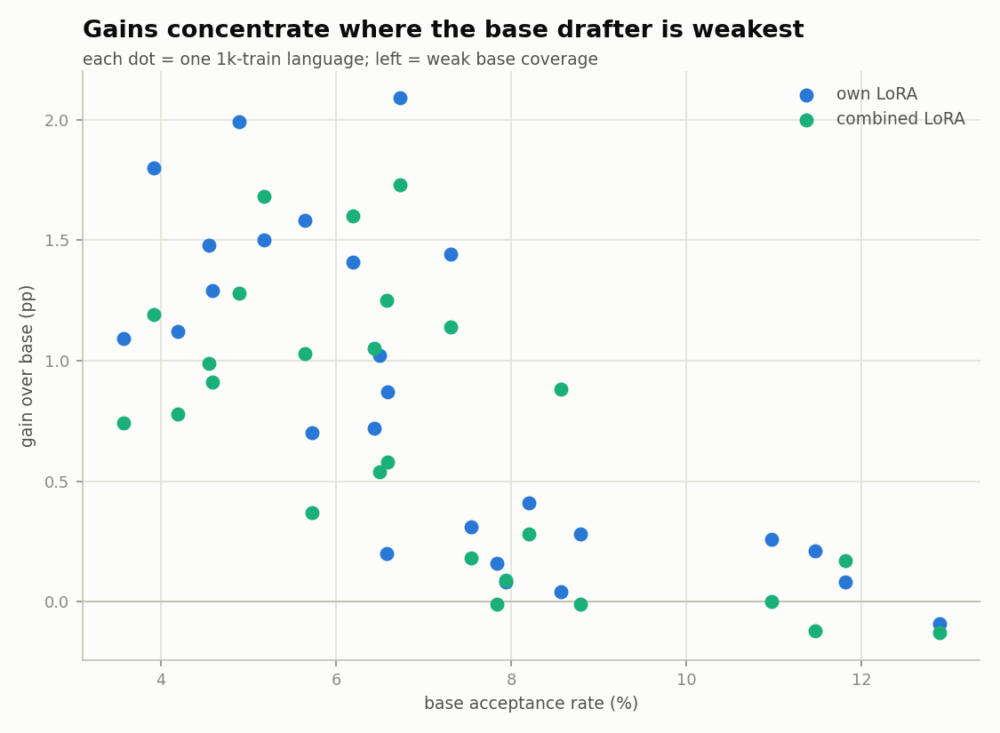
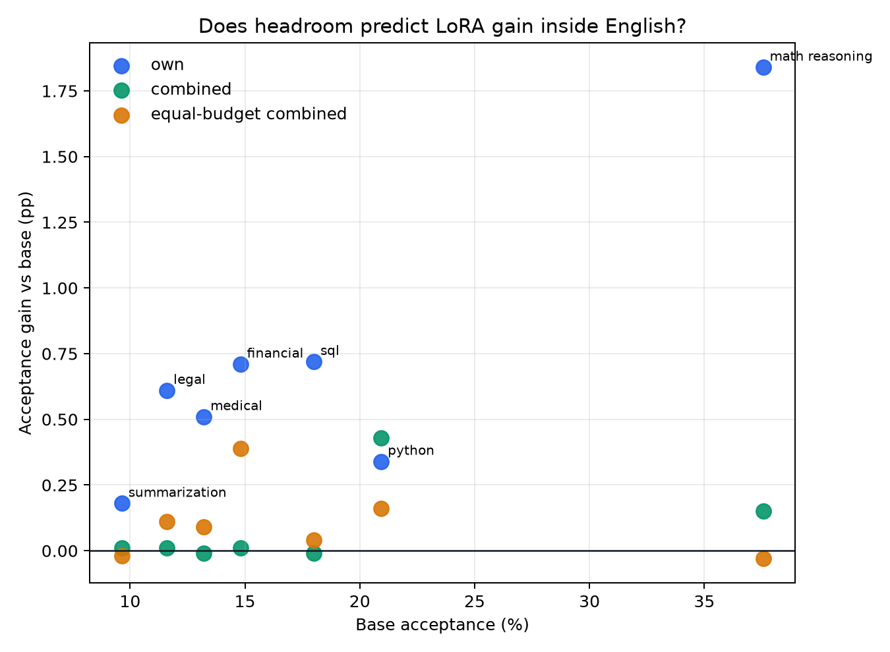

# Specialization is (sometimes) all Speculation needs

**TLDR.** We made speculative decoding **~6% faster in aggregate** on a mixed
serving stream — and **up to +52% relative acceptance** on out-of-distribution
languages (Hebrew 4.2% → 6.4%, Hungarian +46%, Turkish +41%) — by specializing a
block-diffusion drafter with LoRA. Two things surprised us. A rank-16 adapter
*beat a full fine-tune* of the drafter on every weak language, and a single
**combined** LoRA over all languages captured almost all of the per-language
gain (own edges it by only +0.15pp mean, and combined actually wins on the
low-resource lanes via cross-lingual transfer). So for languages, routing to
specialists is rarely worth it. We suspect specialization has much more to give
in *finer-grained* domains where interference is real — early English-subdomain
results already show it, and that is the next post.

# What and why are we specializing?

Speculative decoding is an inference technique in which a small **draft** model
proposes multiple tokens for the large **target** model to verify all at once,
instead of the target generating one token at a time. Every token the target
would have produced anyway is committed for free. For the mechanics from scratch,
[read this blog](https://jwlabs.vercel.app/post/speculative-decoding-first-principles).

You can think of the speculator (the drafter) as an approximation of the verifier
(the target). The important detail: the drafter is **not** trying to be correct in
an external sense — it is trying to *copy the verifier*. If the target would say
"the sky is green," a good drafter proposes "the sky is green," even though "blue"
is more plausible. Because the target always verifies, the output is provably
**lossless**: at temperature 0 the emitted text equals the target's greedy
generation regardless of drafter quality. The adapter changes speed, never
correctness — in every experiment below, the exact-match rate against plain
target decoding is byte-identical across base, LoRA, and full fine-tune.


We hypothesized that since the drafter is a small approximation of the larger
verifier, it has to pick and choose where to be accurate. Common regions get
modeled well; long-tail regions have gaps. If that is true, specializing the
drafter should help most where the base drafter is weakest (out of distribution).


People have specialized speculators before, but little has been done on dynamic
speculators, on specializing diffusion drafters like DFlash, on benchmarking at
larger batch sizes, on serving many unmerged LoRA/NaRA specializations at once,
or on directly comparing combined adapters against full fine-tunes. Below we
sweep domains, routing, and adapters and ask whether they actually make
speculators faster.

# Speculators are uneven across languages

We first benchmarked the most popular speculator for `Qwen/Qwen3-8B` —
`z-lab/Qwen3-8B-DFlash-b16`, a 1B block-diffusion drafter that proposes ~15
tokens per step — across many languages.

We split WildChat-4.8M by its language column and kept 26 languages with at least
1,200 usable conversations (1,000 train / 100 val / 100 test after dedup). Running
the target and measuring acceptance per language gives an almost 4× spread
between the best and worst lanes.

| language | base DFlash acceptance |
| :---- | ----: |
| Polish | 3.57% |
| Hungarian | 3.92% |
| Korean | 4.19% |
| Dutch | 4.55% |
| Romanian | 4.60% |
| Turkish | 4.89% |
| … | … |
| Latin | 11.85% |
| English | 12.90% |


The speculator is extremely domain-sensitive, supporting our hypothesis. It makes
sense that high-resource languages like English and Latin — heavily represented in
the drafter's pretraining — draft best, while lower-resource languages like Polish
and Hungarian, with far less coverage, draft worst.

# Training language-specific LoRAs

LoRA fine-tunes a model by freezing the original weights and training a small
additive adapter, which both prevents the base model from forgetting and lets us
train with far less data. We adapt it to the block-diffusion drafter by attaching
an adapter to all attention projections (`q/k/v/o`).

Using WildChat-4.8M, we split first-turn prompts by language, used up to
1,000 train / 100 val / 100 test per language, and generated target answers
greedily with `Qwen/Qwen3-8B`. This **self-distillation** is what makes the
drafter copy the verifier's actual conditional distribution — including its
mistakes — rather than any dataset gold answer. For each training sequence we
capture the target's hidden states and outputs, sample up to 48 random positions,
and train one rank-16 LoRA for the drafter.


Specialization clearly helps, and it helps in a lawful way:

> **The headroom law.** The LoRA's gain is inversely proportional to how strong
> the base drafter already is on that language. Specialization is easy exactly
> where speculation is slow.


| language | base | own LoRA | gain | relative |
| :---- | ----: | ----: | ----: | ----: |
| Swedish | 6.73% | 8.82% | **+2.09pp** | **+31%** |
| Turkish | 4.89% | 6.88% | +1.99pp | +41% |
| Hungarian | 3.92% | 5.72% | +1.80pp | +46% |
| Ukrainian | 5.65% | 7.23% | +1.58pp | +28% |
| Indonesian | 5.18% | 6.68% | +1.50pp | +29% |
| Dutch | 4.55% | 6.03% | +1.48pp | +33% |
| Vietnamese | 7.31% | 8.75% | +1.44pp | +20% |
| Malay | 6.19% | 7.60% | +1.41pp | +23% |
| Romanian | 4.59% | 5.88% | +1.29pp | +28% |
| Korean | 4.19% | 5.31% | +1.12pp | +27% |
| Polish | 3.57% | 4.66% | +1.09pp | +31% |
| … | | | | |
| French | 10.98% | 11.24% | +0.26pp | +2% |
| Spanish | 11.47% | 11.68% | +0.21pp | +2% |
| Latin | 11.82% | 11.90% | +0.08pp | +1% |
| Japanese | 7.94% | 8.02% | +0.08pp | +1% |
| Yoruba | 8.57% | 8.61% | +0.04pp | +0% |
| English | 12.89% | 12.80% | −0.09pp | −1% |

The weakest languages moved the most — Hungarian jumped +46% relative to its base
— while already-strong languages like English barely moved (or, at −0.09pp, were
already saturated). This is exactly the "largest headroom in out-of-distribution
regimes" the hypothesis predicted.

# LoRA beats a full fine-tune

A natural objection: maybe LoRA isn't the point, and fully fine-tuning the drafter
would do at least as well. On the weakest lanes we trained a *full* DFlash
fine-tune on the same data. Every language's full fine-tune performed **worse**
than its LoRA — and it isn't close.


| language | base | own LoRA | own gain | full FT | full gain |
| :---- | ----: | ----: | ----: | ----: | ----: |
| Polish | 3.57% | 4.66% | +1.09pp (+30.5%) | 3.66% | +0.09pp (+2.5%) |
| Hungarian | 3.92% | 5.72% | +1.80pp (+45.9%) | 4.04% | +0.12pp (+3.1%) |
| Korean | 4.19% | 5.31% | +1.12pp (+26.7%) | 4.30% | +0.11pp (+2.6%) |
| Dutch | 4.55% | 6.03% | +1.48pp (+32.5%) | 4.68% | +0.13pp (+2.9%) |

The LoRA moved the drafter (+1.37pp averaged); the full fine-tune stayed glued to
base (+0.11pp). We don't read this as "full fine-tuning is impossible," but rather
that moving a billion parameters with a couple million supervised tokens is
data-starved, while a rank-16 adapter has exactly the right inductive bias for a
low-rank steering correction and converges on the little data we have. At this
scale, LoRA is the right lever and the whole drafter is the wrong one.

# A tiny, free router between LoRAs

We also trained a router, because it costs almost nothing. DFlash already runs the
target's prefill and conditions on its hidden states, so a router can read *exactly
that tensor* (mean-pooled, 20480-dim) — no extra model, no extra forward pass. Ours
is a 2-layer MLP (20480 → 512 → 26, ~10.5M params) that routes among the 26
languages.


It scores 84.69% validation / 81.58% test accuracy:


The errors are linguistically sensible, never random: Turkish, Japanese, Arabic,
Persian, Korean, and Hungarian route at 96–98%, while the floor is Esperanto (a
constructed Romance-Germanic blend, 27%) and the biggest single confusion is
Indonesian ↔ Malay (mutually intelligible). Tellingly, **English routes at only
59%** — many "English" WildChat rows are really code, spreadsheets, Latin, or
mixed-script prompts that leak into neighboring buckets, which drags the score
down. The router works and is cheap — but, as the next section shows, we rarely
even need it.

# The combined LoRA keeps almost all of the gains

Was the per-language gain because each adapter uniquely learned its language, or
just because it saw more in-language data? The hint that pushed us to check: the
target's hidden states already separate languages cleanly enough for the router to
hit 82%. If the drafter can already tell the languages apart internally, one
adapter trained on *all* of them might not muddle — and languages from the same
family might even help each other. So we trained a single **combined LoRA** over
all languages and put it head-to-head against the per-language specialists.


The combined adapter captures nearly the entire specialist gain. Averaged over the
26 clean languages, the per-language specialists gain **+0.85pp** over base and the
single combined adapter gains **+0.70pp** — a difference of just **+0.15pp**. The
specialists win 19 of 26 languages, but the combined adapter is never far behind,
and it actually *wins* on 6 — Esperanto, Yoruba, Tagalog, Malay, Indonesian, and
Latin — precisely the low-resource or label-noisy lanes, where **cross-lingual
transfer** from related languages does more good than isolated specialization.



Translated into predicted speedup, the two curves are almost indistinguishable
above the base line:


The takeaway reframes the whole result:

> For language specialization, the main win is not picking the right adapter. It
> is adding target-distilled language coverage to the drafter at all — and one
> combined adapter does that for every language at once.

Because language is an easily separable axis, closing the gap is *first* a matter
of giving out-of-distribution languages more coverage; the drafter's hidden states
already keep the languages apart, so there is little interference for specialists
to exploit. We expect that once this coverage saturates, true per-domain
specialization will matter more — which is exactly what we see when the axis gets
harder to separate.

# Interference gets real in finer-grained domains

When the drafter *can't* cleanly separate domains in its hidden states, one
adapter has to "muddle" between them — and more data doesn't fix it, because the
small number of adapter parameters forces a compromise between competing experts.
These are cursory probes; the full study is a follow-up post.

First, an interference ladder: one combined adapter trained over 10, 20, and 40
domains, measured against the matching specialists on a fixed core set.

| combined adapter | mean gap vs own specialist | 95% CI | gain retained |
| :---- | ----: | :----: | ----: |
| 10 domains | −0.21pp | [−0.29, −0.13] | ~74% |
| 20 domains | −0.27pp | [−0.34, −0.20] | ~70% |
| 40 domains | −0.28pp | [−0.36, −0.19] | ~67% |

At 3–5 domains the gap is statistically zero; it first becomes measurable at N≈10
and then *saturates* — going from 20 to 40 domains costs only another ~0.01pp. So
as you pack more experts into one adapter, interference grows but never collapses,
and specialists pull slowly ahead.

Second, to show languages really are the *easy* case, we tried seven English
subdomains (`code_python`, `code_sql`, `ood_legal`, `ood_medical`,
`ood_financial`, `task_math_reasoning`, `task_summarization`), which the drafter
cannot separate as cleanly.


Per-domain specialists beat base **7/7** (math reasoning gains the most, +1.8pp,
37.6% → 39.4%). But the key contrast is the combined adapter: it retains only about
**20%** of the specialist gain, and a data-matched control retains ~18% — so it is
not a data-quantity effect. One adapter simply cannot be a specialist for all seven
at once.



That is the opposite of the language result (combined kept ~85% there), and it is
the crux of the follow-up: **interference depends on the axis.** Languages are
low-interference — one combined adapter is enough. Finer English task/domain
mixtures are higher-interference — specialists start to matter.

# Serving cost

There are two ways to measure the net speedup, and they must be labeled
separately.

**1. Analytic / theoretical.** We can predict wall-clock from acceptance:

```text
speedup ≈ mean_accept_length / (1 + drafter_overhead)
```

where the overhead `c` is a per-speculator, per-engine constant (DFlash on HF
`c ≈ 0.44`). Given `c`, this predicts measured wall-clock to within a few percent
on paired benchmarks, so once it is fitted we can report speedups from acceptance
alone.

**2. Measured / wall-clock.** To get an honest number we ran every serving mode in
*one* H200 container on a worst-case mixed stream: 26 languages × 25 prompts = 650
prompts with **624 language switches**.

| mode | meaning |
| :---- | :---- |
| base | DFlash, no LoRA |
| merged_combined | one combined language LoRA folded into DFlash weights |
| merged_own | traffic routed to N already-merged language specialists |
| hotswap_own | one drafter with unmerged per-language LoRA hot-swapping |

The merged combined LoRA is the production path we care about: it is folded into
the DFlash weights before decoding, so its serving path is identical to the base
drafter — zero added overhead.


| mode | tok/s | speedup vs target-only | relative vs base DFlash | accept | mean accept length |
| :---- | ----: | ----: | ----: | ----: | ----: |
| target-only | 46.78 | 1.000× | – | – | – |
| base DFlash | 66.33 | 1.418× | 1.000× | 6.46% | 1.969 |
| merged combined LoRA | 70.23 | 1.501× | 1.059× | 7.17% | 2.076 |
| N merged own LoRAs | 70.55 | 1.508× | 1.064× | 7.33% | 2.099 |
| hot-swapped own LoRAs | 54.73 | 1.170× | 0.825× | 7.32% | 2.098 |

Three things fall out of this table.

- **The merged combined LoRA is the production path.** It gives **+5.9% wall-clock
  over base DFlash** on a mixed-language stream (1.501× over target-only), and the
  one-time merge cost was only **0.073s**. The N-merged-specialist oracle is +6.4%
  over base — only ~0.5% faster than the combined adapter. For the clean language
  axis, one merged adapter gets essentially all the benefit without serving N
  separate drafters.
- **Higher acceptance does not imply higher throughput.** The hot-swap row has the
  *same* acceptance as the merged specialists (7.32% vs 7.33%) yet runs at 0.825×
  base DFlash — 17.5% *slower* than using no adapter at all. The swaps themselves
  are free: 625 of them cost 0.237s total (~0.4ms each). The slowdown comes
  entirely from keeping the LoRA path *unmerged* inside every drafter forward.
- **Merging is what turns specialization into speed.** Specialize per axis, then
  fold the adapter into the weights; do not serve unmerged wrappers on a switching
  stream.

## Conclusion

For languages, specialization is almost all speculation needs.

The public drafter is weakest on the long language tail; target-distilled LoRAs
patch that weakness in proportion to how weak it was (up to +52% relative
acceptance). But the cleanest production result is simpler than a routed fleet of
specialists: one combined multilingual adapter captures ~85% of the specialist
gain — and beats the specialists outright on low-resource languages via
cross-lingual transfer — as long as it is **merged** into the drafter before
serving. The recipe: find where the drafter fails, distill the target's behavior
there with LoRA (not a full fine-tune), train one combined adapter when the axis
is low-interference, and merge it. Route unmerged specialists only when a combined
adapter actually loses — which, for languages, it rarely does.

## Appendix and future ideas

- **Higher-interference English domains (the next post).** Own-domain LoRAs beat
  base on 7/7 English subdomains, but the combined adapter retained only ~20% of
  the gain — the opposite of the language result. Interference depends on the axis;
  this is the thread we pull next.
- **EAGLE3 and the train–serve alignment tax.** On the stronger EAGLE3 head, early
  language LoRAs appeared to *fail* — which turned out to be two train/serve
  misalignment bugs (reversed aux features, then an unshifted TTT target). With the
  canonical `shift_batch` alignment restored, EAGLE specializes cleanly (own & combined
  beat base 5/5, gains tracking headroom). Feature-conditioned drafters buy cheap
  drafts at the price of a fragile training contract.
- **Rank ladder.** A quick sweep over LoRA rank — the rank is the width of the
  adapter's information bottleneck:

  | language | base | own r16 | own r64 |
  | :---- | ----: | ----: | ----: |
  | Polish | 3.1% | 4.4% | 5.0% |
  | Korean | 3.5% | 5.1% | 5.8% |
  | Italian | 8.1% | 8.5% | 8.7% |
  | Japanese | 5.0% | 5.9% | 6.3% |
  | German | 6.8% | 7.2% | 7.3% |

  *(Directional numbers from the earlier 512-token-cap run; the trend is
  unaffected by the cap.)* Higher rank helps most on the weakest languages, where
  the drafter must actually learn new coverage rather than just realign; on domains
  it already knows, a small rank suffices to steer.
- **Batched adapter serving.** A merged adapter is free at every batch size;
  unmerged wrappers cost a flat ~20%; and serving 50 *distinct* unmerged adapters in
  one batch blows up to +311% overhead at batch 64 — another reason to prefer one
  merged combined LoRA over a served specialist fleet.
